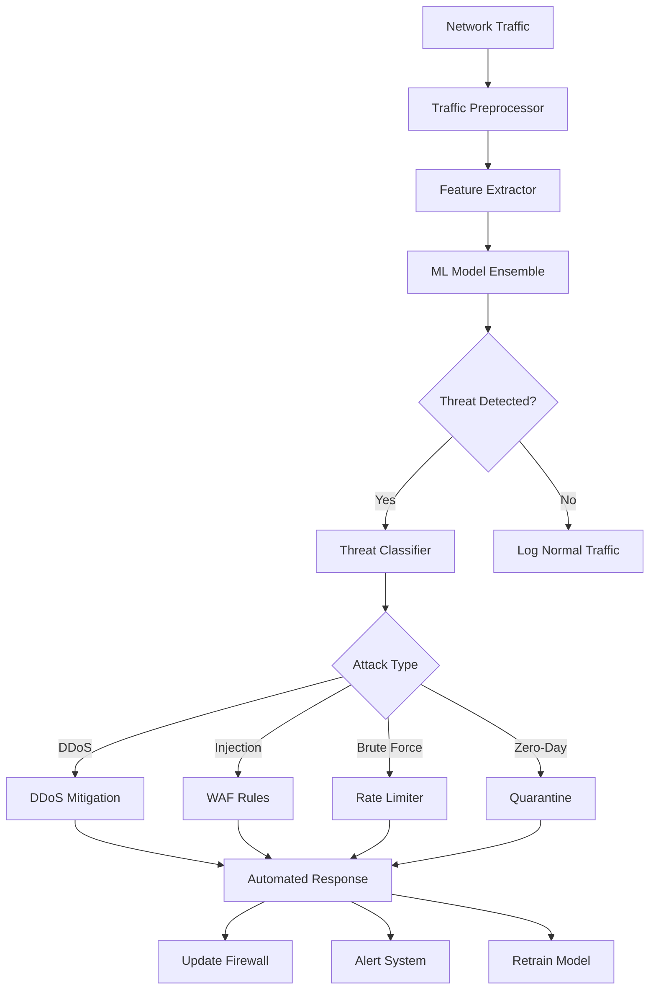

# AI Attack Detection & Defense System

The AI-powered defense system uses machine learning to detect, analyze, and respond to cyber attacks in real-time. It learns from attack patterns and adapts to new threats automatically.

## Overview

The AI Defense Engine provides:
- Real-time threat detection using ML models
- Behavioral analysis of network traffic
- Zero-day threat detection
- Automated attack mitigation
- Pattern recognition for known attack vectors
- Predictive threat modeling

## Architecture



## ML Models

### 1. Traffic Anomaly Detection

Uses unsupervised learning to detect unusual patterns:

```python
import numpy as np
from sklearn.ensemble import IsolationForest
from sklearn.preprocessing import StandardScaler

class TrafficAnomalyDetector:
    def __init__(self):
        self.model = IsolationForest(
            contamination=0.1,
            random_state=42,
            n_estimators=100
        )
        self.scaler = StandardScaler()
        self.is_trained = False

    def extract_features(self, traffic_data):
        """Extract relevant features from network traffic"""
        features = []
        for packet in traffic_data:
            features.append([
                packet['size'],
                packet['duration'],
                packet['packets_per_second'],
                packet['unique_ips'],
                packet['port_diversity'],
                packet['protocol_flags'],
                packet['payload_entropy']
            ])
        return np.array(features)

    def train(self, normal_traffic):
        """Train on normal traffic patterns"""
        features = self.extract_features(normal_traffic)
        scaled_features = self.scaler.fit_transform(features)
        self.model.fit(scaled_features)
        self.is_trained = True

    def predict(self, traffic_sample):
        """Predict if traffic is anomalous"""
        if not self.is_trained:
            raise Exception("Model not trained yet")

        features = self.extract_features([traffic_sample])
        scaled_features = self.scaler.transform(features)
        prediction = self.model.predict(scaled_features)

        # -1 = anomaly, 1 = normal
        return {
            'is_anomaly': prediction[0] == -1,
            'anomaly_score': self.model.score_samples(scaled_features)[0],
            'features': features[0].tolist()
        }

    def update_model(self, new_data, labels):
        """Incrementally update model with new data"""
        # Retrain with new data
        features = self.extract_features(new_data)
        scaled_features = self.scaler.transform(features)
        self.model.fit(np.vstack([self.model.estimators_[0].X_, scaled_features]))
```

### 2. Attack Classification Model

Classifies detected attacks into specific types:

```python
from sklearn.ensemble import RandomForestClassifier
from sklearn.neural_network import MLPClassifier
import joblib

class AttackClassifier:
    def __init__(self):
        self.models = {
            'random_forest': RandomForestClassifier(n_estimators=200, max_depth=20),
            'neural_net': MLPClassifier(hidden_layers=(100, 50), max_iter=500)
        }
        self.attack_types = [
            'ddos',
            'sql_injection',
            'xss',
            'brute_force',
            'path_traversal',
            'command_injection',
            'xxe',
            'csrf',
            'zero_day'
        ]

    def train(self, X_train, y_train):
        """Train ensemble of classifiers"""
        for name, model in self.models.items():
            print(f"Training {name}...")
            model.fit(X_train, y_train)

    def predict(self, features):
        """Predict attack type using ensemble voting"""
        predictions = []
        confidences = []

        for name, model in self.models.items():
            pred = model.predict([features])[0]
            prob = model.predict_proba([features])[0]
            predictions.append(pred)
            confidences.append(max(prob))

        # Majority voting
        from collections import Counter
        final_prediction = Counter(predictions).most_common(1)[0][0]
        avg_confidence = sum(confidences) / len(confidences)

        return {
            'attack_type': self.attack_types[final_prediction],
            'confidence': avg_confidence,
            'all_predictions': predictions
        }

    def save_models(self, path):
        """Save trained models"""
        for name, model in self.models.items():
            joblib.dump(model, f"{path}/{name}.pkl")

    def load_models(self, path):
        """Load trained models"""
        for name in self.models.keys():
            self.models[name] = joblib.load(f"{path}/{name}.pkl")
```

### 3. Behavioral Analysis Engine

Analyzes user and system behavior for insider threats:

```javascript
class BehaviorAnalyzer {
  constructor() {
    this.userProfiles = new Map();
    this.baselineWindow = 7 * 24 * 60 * 60 * 1000; // 7 days
  }

  /**
   * Build behavioral baseline for user
   */
  async buildBaseline(userId, historicalData) {
    const profile = {
      avgRequestsPerHour: 0,
      commonEndpoints: [],
      typicalAccessTimes: [],
      usualLocations: [],
      deviceFingerprints: [],
      dataAccessPatterns: {}
    };

    // Calculate averages
    const requestsByHour = historicalData.reduce((acc, req) => {
      const hour = new Date(req.timestamp).getHours();
      acc[hour] = (acc[hour] || 0) + 1;
      return acc;
    }, {});

    profile.avgRequestsPerHour = Object.values(requestsByHour).reduce((a, b) => a + b) / 24;

    // Most common endpoints
    const endpointCounts = historicalData.reduce((acc, req) => {
      acc[req.endpoint] = (acc[req.endpoint] || 0) + 1;
      return acc;
    }, {});

    profile.commonEndpoints = Object.entries(endpointCounts)
      .sort((a, b) => b[1] - a[1])
      .slice(0, 10)
      .map(e => e[0]);

    // Typical access times (working hours vs off-hours)
    profile.typicalAccessTimes = Object.keys(requestsByHour)
      .filter(hour => requestsByHour[hour] > profile.avgRequestsPerHour)
      .map(h => parseInt(h));

    // Store profile
    this.userProfiles.set(userId, profile);
    return profile;
  }

  /**
   * Detect anomalous behavior
   */
  async detectAnomaly(userId, currentActivity) {
    const profile = this.userProfiles.get(userId);
    if (!profile) {
      return { anomaly: false, reason: 'No baseline established' };
    }

    const anomalies = [];
    let anomalyScore = 0;

    // Check request rate
    if (currentActivity.requestsThisHour > profile.avgRequestsPerHour * 3) {
      anomalies.push('Unusual request rate');
      anomalyScore += 0.3;
    }

    // Check endpoint access
    const unusualEndpoints = currentActivity.endpoints.filter(
      ep => !profile.commonEndpoints.includes(ep)
    );
    if (unusualEndpoints.length > 5) {
      anomalies.push('Accessing unusual endpoints');
      anomalyScore += 0.4;
    }

    // Check access time
    const currentHour = new Date().getHours();
    if (!profile.typicalAccessTimes.includes(currentHour)) {
      anomalies.push('Access at unusual time');
      anomalyScore += 0.2;
    }

    // Check location
    if (currentActivity.location && !profile.usualLocations.includes(currentActivity.location)) {
      anomalies.push('Access from unusual location');
      anomalyScore += 0.5;
    }

    // Check for privilege escalation attempts
    if (currentActivity.privilegeLevel > profile.normalPrivilegeLevel) {
      anomalies.push('Privilege escalation attempt');
      anomalyScore += 0.8;
    }

    return {
      anomaly: anomalyScore > 0.6,
      score: anomalyScore,
      reasons: anomalies,
      recommendation: anomalyScore > 0.8 ? 'block' : 'monitor'
    };
  }
}

module.exports = BehaviorAnalyzer;
```

## Real-time Threat Detection

### Traffic Analysis Pipeline

```javascript
const tf = require('@tensorflow/tfjs-node');

class RealTimeThreatDetector {
  constructor() {
    this.model = null;
    this.featureExtractor = null;
    this.threatThreshold = 0.75;
  }

  /**
   * Load pre-trained TensorFlow model
   */
  async loadModel(modelPath) {
    this.model = await tf.loadLayersModel(`file://${modelPath}/model.json`);
    console.log('AI model loaded successfully');
  }

  /**
   * Extract features from HTTP request
   */
  extractFeatures(request) {
    return {
      // Request characteristics
      method: this.encodeMethod(request.method),
      pathLength: request.path.length,
      queryParamCount: Object.keys(request.query || {}).length,
      headerCount: Object.keys(request.headers).length,

      // Content analysis
      bodySize: request.body ? JSON.stringify(request.body).length : 0,
      hasUserAgent: !!request.headers['user-agent'],
      contentType: this.encodeContentType(request.headers['content-type']),

      // Security indicators
      hasSuspiciousChars: this.containsSuspiciousChars(request.path + JSON.stringify(request.query)),
      pathDepth: request.path.split('/').length,
      hasScriptTags: /<script/i.test(JSON.stringify(request)),
      hasSQLKeywords: /union|select|insert|update|delete|drop/i.test(JSON.stringify(request)),

      // Rate limiting features
      requestsLastMinute: this.getRequestCount(request.ip, 60),
      requestsLastHour: this.getRequestCount(request.ip, 3600),

      // Entropy analysis
      pathEntropy: this.calculateEntropy(request.path),
      payloadEntropy: request.body ? this.calculateEntropy(JSON.stringify(request.body)) : 0
    };
  }

  /**
   * Calculate Shannon entropy
   */
  calculateEntropy(str) {
    const len = str.length;
    const frequencies = {};

    for (let char of str) {
      frequencies[char] = (frequencies[char] || 0) + 1;
    }

    let entropy = 0;
    for (let freq of Object.values(frequencies)) {
      const p = freq / len;
      entropy -= p * Math.log2(p);
    }

    return entropy;
  }

  /**
   * Detect threats in real-time
   */
  async analyzeRequest(request) {
    const features = this.extractFeatures(request);
    const featureVector = this.featuresToVector(features);

    // Run through ML model
    const tensor = tf.tensor2d([featureVector]);
    const prediction = this.model.predict(tensor);
    const threatScore = (await prediction.data())[0];

    tensor.dispose();
    prediction.dispose();

    const result = {
      threatScore: threatScore,
      isThreat: threatScore > this.threatThreshold,
      features: features,
      timestamp: new Date().toISOString(),
      requestId: request.id
    };

    // If threat detected, get attack classification
    if (result.isThreat) {
      result.attackType = await this.classifyAttack(features);
      result.recommendedAction = this.getRecommendedAction(result.attackType, threatScore);
    }

    return result;
  }

  /**
   * Classify attack type
   */
  async classifyAttack(features) {
    // Rule-based classification
    if (features.hasSQLKeywords && features.pathEntropy > 4) {
      return 'sql_injection';
    }
    if (features.hasScriptTags) {
      return 'xss';
    }
    if (features.requestsLastMinute > 100) {
      return 'ddos';
    }
    if (features.pathLength > 200 || features.hasSuspiciousChars) {
      return 'path_traversal';
    }

    return 'unknown';
  }

  /**
   * Get recommended action based on threat
   */
  getRecommendedAction(attackType, threatScore) {
    const actions = {
      'sql_injection': { action: 'block', duration: 3600 },
      'xss': { action: 'block', duration: 3600 },
      'ddos': { action: 'rate_limit', duration: 600 },
      'path_traversal': { action: 'block', duration: 7200 },
      'unknown': { action: threatScore > 0.9 ? 'block' : 'monitor', duration: 1800 }
    };

    return actions[attackType] || actions['unknown'];
  }

  /**
   * Check for suspicious characters
   */
  containsSuspiciousChars(str) {
    const suspicious = [
      '../',
      '..\\',
      '<script>',
      'javascript:',
      'onerror=',
      'onload=',
      'eval(',
      'exec(',
      'system(',
      '${',
      '<%'
    ];

    return suspicious.some(pattern => str.includes(pattern));
  }
}

module.exports = RealTimeThreatDetector;
```

## API Integration

### Threat Analysis API

**Endpoint**: `POST /api/v1/ai/analyze`

**Request**:
```json
{
  "request": {
    "method": "POST",
    "path": "/api/users",
    "headers": {
      "user-agent": "Mozilla/5.0...",
      "content-type": "application/json"
    },
    "body": {
      "username": "admin' OR '1'='1",
      "password": "password"
    },
    "ip": "192.168.1.100"
  }
}
```

**Response**:
```json
{
  "threatScore": 0.92,
  "isThreat": true,
  "attackType": "sql_injection",
  "confidence": 0.87,
  "recommendedAction": {
    "action": "block",
    "duration": 3600
  },
  "details": {
    "detectedPatterns": [
      "SQL keywords in input",
      "SQL comment syntax",
      "Boolean logic injection"
    ],
    "features": {
      "hasSQLKeywords": true,
      "pathEntropy": 4.2,
      "threatScore": 0.92
    }
  }
}
```

### Model Training API

**Endpoint**: `POST /api/v1/ai/train`

**Request**:
```json
{
  "trainingData": [
    {
      "features": {...},
      "label": "malicious"
    }
  ],
  "modelType": "attack_classifier",
  "epochs": 50
}
```

## n8n Workflow Integration

### Workflow: AI-Powered Traffic Analysis

```json
{
  "name": "AI Traffic Analyzer",
  "nodes": [
    {
      "name": "HTTP Request Trigger",
      "type": "n8n-nodes-base.webhook",
      "parameters": {
        "path": "traffic-analyze",
        "responseMode": "lastNode"
      }
    },
    {
      "name": "AI Threat Analysis",
      "type": "n8n-nodes-base.httpRequest",
      "parameters": {
        "url": "http://localhost:5000/api/v1/ai/analyze",
        "method": "POST",
        "body": {
          "request": "={{$json}}"
        }
      }
    },
    {
      "name": "Check Threat Level",
      "type": "n8n-nodes-base.switch",
      "parameters": {
        "conditions": {
          "number": [
            {
              "value1": "={{$json.threatScore}}",
              "operation": "larger",
              "value2": 0.75
            }
          ]
        }
      }
    },
    {
      "name": "High Threat - Block",
      "type": "n8n-nodes-base.httpRequest",
      "parameters": {
        "url": "http://localhost:5678/api/v1/firewall/block",
        "method": "POST",
        "body": {
          "ip": "={{$json.request.ip}}",
          "reason": "AI detected: {{$json.attackType}}",
          "duration": "={{$json.recommendedAction.duration}}"
        }
      }
    },
    {
      "name": "Medium Threat - Monitor",
      "type": "n8n-nodes-base.code",
      "parameters": {
        "jsCode": "// Log to security database\nconst incident = {\n  ip: $json.request.ip,\n  threatScore: $json.threatScore,\n  attackType: $json.attackType,\n  timestamp: new Date().toISOString(),\n  action: 'monitored'\n};\n\nreturn [{ json: incident }];"
      }
    },
    {
      "name": "Update ML Model",
      "type": "n8n-nodes-base.httpRequest",
      "parameters": {
        "url": "http://localhost:5000/api/v1/ai/feedback",
        "method": "POST",
        "body": {
          "requestId": "={{$json.requestId}}",
          "confirmed": true,
          "actualLabel": "={{$json.attackType}}"
        }
      }
    },
    {
      "name": "Alert Security Team",
      "type": "n8n-nodes-base.emailSend",
      "parameters": {
        "toEmail": "security@example.com",
        "subject": "🚨 AI Detected Threat - {{$json.attackType}}",
        "html": "<h2>Threat Detected</h2><p>Score: {{$json.threatScore}}</p><p>Type: {{$json.attackType}}</p><p>IP: {{$json.request.ip}}</p>"
      }
    }
  ],
  "connections": {
    "HTTP Request Trigger": {
      "main": [[{ "node": "AI Threat Analysis" }]]
    },
    "AI Threat Analysis": {
      "main": [[{ "node": "Check Threat Level" }]]
    },
    "Check Threat Level": {
      "main": [
        [{ "node": "High Threat - Block" }],
        [{ "node": "Medium Threat - Monitor" }]
      ]
    },
    "High Threat - Block": {
      "main": [[{ "node": "Update ML Model" }, { "node": "Alert Security Team" }]]
    }
  }
}
```

## Model Training

### Collect Training Data

```javascript
class TrainingDataCollector {
  constructor(dbConnection) {
    this.db = dbConnection;
  }

  /**
   * Collect labeled attack samples
   */
  async collectAttackSamples() {
    // Get from honeypot logs
    const honeypotData = await this.db.query(`
      SELECT * FROM honeypot_logs
      WHERE created_at > NOW() - INTERVAL '30 days'
    `);

    // Get from blocked requests
    const blockedData = await this.db.query(`
      SELECT * FROM firewall_blocks
      WHERE created_at > NOW() - INTERVAL '30 days'
    `);

    // Get from security incidents
    const incidentData = await this.db.query(`
      SELECT * FROM security_incidents
      WHERE confirmed = true
    `);

    return {
      malicious: [...honeypotData, ...blockedData, ...incidentData],
      count: honeypotData.length + blockedData.length + incidentData.length
    };
  }

  /**
   * Collect normal traffic samples
   */
  async collectNormalSamples() {
    const normalData = await this.db.query(`
      SELECT * FROM request_logs
      WHERE threat_score < 0.3
      AND created_at > NOW() - INTERVAL '30 days'
      ORDER BY RANDOM()
      LIMIT 10000
    `);

    return {
      normal: normalData,
      count: normalData.length
    };
  }

  /**
   * Prepare dataset for training
   */
  async prepareDataset() {
    const malicious = await this.collectAttackSamples();
    const normal = await this.collectNormalSamples();

    const dataset = [
      ...malicious.malicious.map(sample => ({
        features: this.extractFeatures(sample),
        label: 1 // Malicious
      })),
      ...normal.normal.map(sample => ({
        features: this.extractFeatures(sample),
        label: 0 // Normal
      }))
    ];

    // Shuffle dataset
    return this.shuffleArray(dataset);
  }
}
```

## Performance Optimization

### Model Caching

```javascript
const NodeCache = require('node-cache');

class AIModelCache {
  constructor() {
    this.cache = new NodeCache({
      stdTTL: 3600, // 1 hour
      checkperiod: 600
    });
  }

  /**
   * Cache prediction results
   */
  async cachePrediction(requestHash, result) {
    this.cache.set(requestHash, result);
  }

  /**
   * Get cached prediction
   */
  async getCachedPrediction(requestHash) {
    return this.cache.get(requestHash);
  }
}
```

### Batch Processing

Process multiple requests in batches for better performance:

```javascript
class BatchProcessor {
  constructor(batchSize = 100, timeWindow = 1000) {
    this.batchSize = batchSize;
    this.timeWindow = timeWindow;
    this.queue = [];
    this.processing = false;
  }

  async addRequest(request) {
    this.queue.push(request);

    if (this.queue.length >= this.batchSize && !this.processing) {
      await this.processBatch();
    }
  }

  async processBatch() {
    this.processing = true;
    const batch = this.queue.splice(0, this.batchSize);

    // Process batch through AI model
    const results = await this.model.predictBatch(batch);

    // Handle results
    for (let i = 0; i < results.length; i++) {
      await this.handleResult(batch[i], results[i]);
    }

    this.processing = false;
  }
}
```

## Metrics & Monitoring

Track these metrics:
- **Detection Rate**: Percentage of actual attacks detected
- **False Positive Rate**: Normal traffic incorrectly flagged
- **Model Accuracy**: Overall prediction accuracy
- **Inference Time**: Time to analyze each request
- **Threat Score Distribution**: Distribution of scores
- **Attack Type Breakdown**: Frequency of each attack type

## Next Steps

- [Network Scanner Setup](./network-scanner.md)
- [Traffic Scanner Configuration](./traffic-scanner.md)
- [Vulnerability Management](./vulnerability-scanner.md)
- [Ethical Hacking & Simulation](./ethical-hacking.md)
