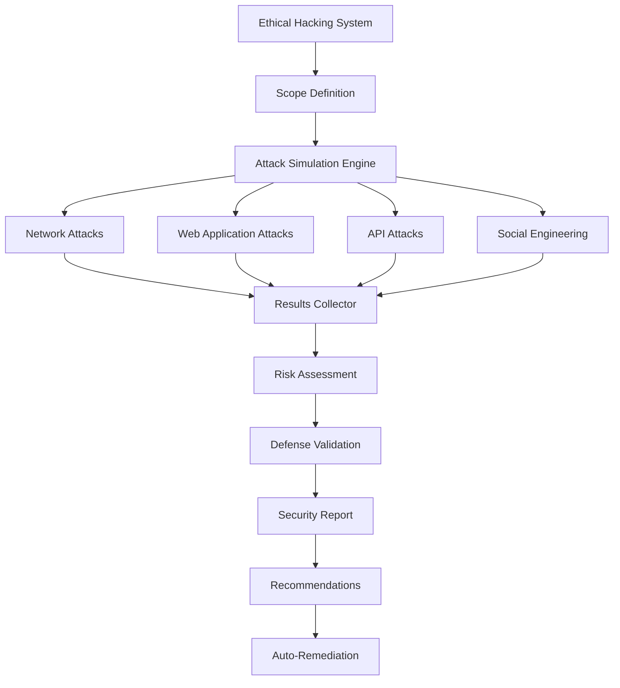

# Ethical Hacking & AI Attack Simulation

Comprehensive ethical hacking tools and AI-powered attack simulation system for testing and improving your security defenses.

## Overview

The Ethical Hacking & Simulation system provides:
- **Penetration Testing**: Automated security testing
- **AI Attack Simulation**: Machine learning-driven attack scenarios
- **Red Team Operations**: Simulated adversary techniques
- **Security Validation**: Test defense mechanisms
- **Compliance Testing**: Verify security controls
- **Training Scenarios**: Security awareness training

## ⚠️ Legal & Ethical Guidelines

### IMPORTANT - READ BEFORE USE

This tool should ONLY be used:
- ✅ On systems you own or have explicit written permission to test
- ✅ For authorized penetration testing engagements
- ✅ For security research in controlled environments
- ✅ For educational purposes in lab environments
- ✅ With proper scope and rules of engagement documented

NEVER use these tools:
- ❌ On systems you don't own or have permission to test
- ❌ For malicious purposes
- ❌ To cause harm or disruption
- ❌ To access unauthorized data
- ❌ Without proper authorization documentation

**Unauthorized access to computer systems is illegal in most jurisdictions.**

## Architecture



## Penetration Testing Framework

### Implementation

```javascript
const EventEmitter = require('events');

class PenetrationTester extends EventEmitter {
  constructor(target, authorization) {
    super();
    this.target = target;
    this.authorization = authorization;
    this.results = [];
    this.scope = {
      inScope: [],
      outOfScope: [],
      maxIntensity: 'low' // low, medium, high
    };
  }

  /**
   * Verify authorization before testing
   */
  async verifyAuthorization() {
    if (!this.authorization || !this.authorization.signedDocument) {
      throw new Error('No valid authorization. Testing cannot proceed.');
    }

    // Verify authorization is current
    const authDate = new Date(this.authorization.date);
    const now = new Date();
    const daysSinceAuth = (now - authDate) / (1000 * 60 * 60 * 24);

    if (daysSinceAuth > 30) {
      throw new Error('Authorization expired. Please obtain new authorization.');
    }

    console.log('✓ Authorization verified');
    this.emit('authorization_verified', this.authorization);
    return true;
  }

  /**
   * Define testing scope
   */
  setScope(inScope, outOfScope = []) {
    this.scope.inScope = inScope;
    this.scope.outOfScope = outOfScope;

    console.log('Scope defined:');
    console.log('  In Scope:', inScope);
    console.log('  Out of Scope:', outOfScope);

    this.emit('scope_defined', this.scope);
  }

  /**
   * Run full penetration test
   */
  async runFullTest() {
    try {
      // Verify authorization
      await this.verifyAuthorization();

      console.log('Starting penetration test...');
      this.emit('test_started', { target: this.target, timestamp: new Date() });

      // Phase 1: Reconnaissance
      console.log('Phase 1: Reconnaissance');
      await this.reconnaissance();

      // Phase 2: Vulnerability Scanning
      console.log('Phase 2: Vulnerability Scanning');
      await this.vulnerabilityScanning();

      // Phase 3: Exploitation
      console.log('Phase 3: Exploitation (Simulated)');
      await this.exploitation();

      // Phase 4: Post-Exploitation
      console.log('Phase 4: Post-Exploitation Analysis');
      await this.postExploitation();

      // Generate report
      const report = await this.generateReport();

      this.emit('test_completed', { report: report, timestamp: new Date() });

      return report;
    } catch (error) {
      this.emit('test_error', error);
      throw error;
    }
  }

  /**
   * Reconnaissance phase
   */
  async reconnaissance() {
    const recon = {
      phase: 'reconnaissance',
      findings: []
    };

    // DNS enumeration
    const dnsInfo = await this.dnsEnumeration();
    recon.findings.push({ type: 'dns', data: dnsInfo });

    // Port scanning
    const ports = await this.portScan();
    recon.findings.push({ type: 'ports', data: ports });

    // Service detection
    const services = await this.serviceDetection();
    recon.findings.push({ type: 'services', data: services });

    this.results.push(recon);
    this.emit('phase_completed', recon);
  }

  /**
   * DNS enumeration
   */
  async dnsEnumeration() {
    const dns = require('dns').promises;
    const findings = [];

    try {
      // A records
      const addresses = await dns.resolve4(this.target);
      findings.push({ type: 'A', records: addresses });

      // MX records
      const mx = await dns.resolveMx(this.target);
      findings.push({ type: 'MX', records: mx });

      // TXT records
      const txt = await dns.resolveTxt(this.target);
      findings.push({ type: 'TXT', records: txt });

      // NS records
      const ns = await dns.resolveNs(this.target);
      findings.push({ type: 'NS', records: ns });
    } catch (error) {
      findings.push({ error: error.message });
    }

    return findings;
  }

  /**
   * Port scanning
   */
  async portScan() {
    const net = require('net');
    const commonPorts = [21, 22, 23, 25, 80, 443, 3306, 5432, 8080, 8443];
    const openPorts = [];

    for (const port of commonPorts) {
      const isOpen = await this.checkPort(this.target, port);
      if (isOpen) {
        openPorts.push({
          port: port,
          service: this.getServiceName(port),
          risk: this.assessPortRisk(port)
        });
      }
    }

    return openPorts;
  }

  /**
   * Check if port is open
   */
  async checkPort(host, port) {
    return new Promise((resolve) => {
      const socket = new (require('net')).Socket();
      socket.setTimeout(1000);

      socket.on('connect', () => {
        socket.destroy();
        resolve(true);
      });

      socket.on('timeout', () => {
        socket.destroy();
        resolve(false);
      });

      socket.on('error', () => {
        resolve(false);
      });

      socket.connect(port, host);
    });
  }

  /**
   * Get service name for port
   */
  getServiceName(port) {
    const services = {
      21: 'FTP',
      22: 'SSH',
      23: 'Telnet',
      25: 'SMTP',
      80: 'HTTP',
      443: 'HTTPS',
      3306: 'MySQL',
      5432: 'PostgreSQL',
      8080: 'HTTP-Proxy',
      8443: 'HTTPS-Alt'
    };
    return services[port] || 'Unknown';
  }

  /**
   * Assess port risk
   */
  assessPortRisk(port) {
    const highRisk = [21, 23, 3306, 5432]; // FTP, Telnet, DB ports
    const mediumRisk = [22, 25, 8080];
    const lowRisk = [80, 443, 8443];

    if (highRisk.includes(port)) return 'HIGH';
    if (mediumRisk.includes(port)) return 'MEDIUM';
    return 'LOW';
  }

  /**
   * Service detection
   */
  async serviceDetection() {
    // Banner grabbing and service fingerprinting
    const services = [];

    // This would use tools like nmap, but simplified here
    return services;
  }

  /**
   * Vulnerability scanning
   */
  async vulnerabilityScanning() {
    const vulnScan = {
      phase: 'vulnerability_scanning',
      findings: []
    };

    // Web application vulnerabilities
    const webVulns = await this.scanWebVulnerabilities();
    vulnScan.findings.push({ category: 'web', vulnerabilities: webVulns });

    // Network vulnerabilities
    const netVulns = await this.scanNetworkVulnerabilities();
    vulnScan.findings.push({ category: 'network', vulnerabilities: netVulns });

    this.results.push(vulnScan);
    this.emit('phase_completed', vulnScan);
  }

  /**
   * Scan for web vulnerabilities
   */
  async scanWebVulnerabilities() {
    const vulnerabilities = [];

    // SQL Injection test
    const sqlInjTest = await this.testSQLInjection();
    if (sqlInjTest.vulnerable) {
      vulnerabilities.push({
        type: 'SQL Injection',
        severity: 'CRITICAL',
        details: sqlInjTest
      });
    }

    // XSS test
    const xssTest = await this.testXSS();
    if (xssTest.vulnerable) {
      vulnerabilities.push({
        type: 'XSS',
        severity: 'HIGH',
        details: xssTest
      });
    }

    // CSRF test
    const csrfTest = await this.testCSRF();
    if (csrfTest.vulnerable) {
      vulnerabilities.push({
        type: 'CSRF',
        severity: 'MEDIUM',
        details: csrfTest
      });
    }

    return vulnerabilities;
  }

  /**
   * Test for SQL injection
   */
  async testSQLInjection() {
    const axios = require('axios');
    const payloads = ["'", "1' OR '1'='1", "admin'--"];

    for (const payload of payloads) {
      try {
        const response = await axios.get(`${this.target}/api/users`, {
          params: { id: payload },
          validateStatus: () => true
        });

        const data = JSON.stringify(response.data);

        // Check for SQL errors
        if (data.match(/sql|syntax|mysql|postgres|sqlite/i)) {
          return {
            vulnerable: true,
            payload: payload,
            response: data.substring(0, 200)
          };
        }
      } catch (error) {
        // Continue testing
      }
    }

    return { vulnerable: false };
  }

  /**
   * Test for XSS
   */
  async testXSS() {
    const axios = require('axios');
    const payload = '<script>alert("XSS")</script>';

    try {
      const response = await axios.post(`${this.target}/api/comment`, {
        comment: payload
      });

      if (response.data && JSON.stringify(response.data).includes(payload)) {
        return {
          vulnerable: true,
          payload: payload,
          endpoint: '/api/comment'
        };
      }
    } catch (error) {
      // Error
    }

    return { vulnerable: false };
  }

  /**
   * Test for CSRF
   */
  async testCSRF() {
    const axios = require('axios');

    try {
      // Check if CSRF token is required
      const response = await axios.post(`${this.target}/api/sensitive-action`, {
        data: 'test'
      }, {
        validateStatus: () => true
      });

      // If request succeeds without CSRF token, it's vulnerable
      if (response.status === 200) {
        return {
          vulnerable: true,
          endpoint: '/api/sensitive-action',
          issue: 'No CSRF protection detected'
        };
      }
    } catch (error) {
      // Error
    }

    return { vulnerable: false };
  }

  /**
   * Scan network vulnerabilities
   */
  async scanNetworkVulnerabilities() {
    // Check for weak SSL/TLS
    // Check for open unnecessary ports
    // Check for default credentials
    return [];
  }

  /**
   * Exploitation phase (SIMULATED ONLY)
   */
  async exploitation() {
    // IMPORTANT: This should only simulate exploitation, not actually exploit
    const exploits = {
      phase: 'exploitation_simulation',
      simulated_exploits: []
    };

    // Simulate potential exploits based on findings
    for (const result of this.results) {
      if (result.phase === 'vulnerability_scanning') {
        for (const finding of result.findings) {
          for (const vuln of finding.vulnerabilities || []) {
            exploits.simulated_exploits.push({
              vulnerability: vuln.type,
              severity: vuln.severity,
              exploitation_possible: true,
              simulated: true,
              impact: this.assessImpact(vuln)
            });
          }
        }
      }
    }

    this.results.push(exploits);
    this.emit('phase_completed', exploits);
  }

  /**
   * Assess impact
   */
  assessImpact(vulnerability) {
    if (vulnerability.type === 'SQL Injection') {
      return {
        confidentiality: 'HIGH',
        integrity: 'HIGH',
        availability: 'MEDIUM',
        description: 'Potential database compromise, data exfiltration'
      };
    }

    if (vulnerability.type === 'XSS') {
      return {
        confidentiality: 'MEDIUM',
        integrity: 'MEDIUM',
        availability: 'LOW',
        description: 'Session hijacking, credential theft possible'
      };
    }

    return {
      confidentiality: 'LOW',
      integrity: 'LOW',
      availability: 'LOW',
      description: 'Limited impact'
    };
  }

  /**
   * Post-exploitation analysis
   */
  async postExploitation() {
    const postExploit = {
      phase: 'post_exploitation',
      analysis: {
        data_at_risk: this.identifyDataAtRisk(),
        lateral_movement: this.assessLateralMovement(),
        persistence: this.assessPersistence()
      }
    };

    this.results.push(postExploit);
    this.emit('phase_completed', postExploit);
  }

  /**
   * Identify data at risk
   */
  identifyDataAtRisk() {
    // Analyze what data could be compromised
    return {
      user_data: 'HIGH RISK',
      financial_data: 'MEDIUM RISK',
      system_data: 'MEDIUM RISK'
    };
  }

  /**
   * Assess lateral movement possibilities
   */
  assessLateralMovement() {
    return {
      possible: true,
      paths: ['Database server', 'Internal API']
    };
  }

  /**
   * Assess persistence mechanisms
   */
  assessPersistence() {
    return {
      possible: false,
      mechanisms: []
    };
  }

  /**
   * Generate comprehensive report
   */
  async generateReport() {
    const criticalFindings = this.getCriticalFindings();
    const recommendations = this.generateRecommendations();

    return {
      executive_summary: {
        target: this.target,
        test_date: new Date(),
        authorization: this.authorization.number,
        critical_findings: criticalFindings.length,
        overall_risk: this.calculateOverallRisk(),
        recommendation: recommendations.top
      },
      detailed_findings: this.results,
      critical_issues: criticalFindings,
      recommendations: recommendations.all,
      compliance: this.checkCompliance(),
      next_steps: this.getNextSteps()
    };
  }

  /**
   * Get critical findings
   */
  getCriticalFindings() {
    const critical = [];

    for (const result of this.results) {
      if (result.findings) {
        for (const finding of result.findings) {
          for (const vuln of finding.vulnerabilities || []) {
            if (vuln.severity === 'CRITICAL' || vuln.severity === 'HIGH') {
              critical.push(vuln);
            }
          }
        }
      }
    }

    return critical;
  }

  /**
   * Calculate overall risk
   */
  calculateOverallRisk() {
    const critical = this.results.filter(r =>
      r.findings?.some(f =>
        f.vulnerabilities?.some(v => v.severity === 'CRITICAL')
      )
    ).length;

    if (critical > 0) return 'CRITICAL';

    const high = this.results.filter(r =>
      r.findings?.some(f =>
        f.vulnerabilities?.some(v => v.severity === 'HIGH')
      )
    ).length;

    if (high > 2) return 'HIGH';
    if (high > 0) return 'MEDIUM';

    return 'LOW';
  }

  /**
   * Generate recommendations
   */
  generateRecommendations() {
    const recommendations = [];

    const critical = this.getCriticalFindings();

    for (const issue of critical) {
      if (issue.type === 'SQL Injection') {
        recommendations.push({
          priority: 'CRITICAL',
          issue: 'SQL Injection vulnerability',
          recommendation: 'Implement parameterized queries and input validation immediately',
          effort: 'Medium',
          timeline: 'Immediate (< 24 hours)'
        });
      }

      if (issue.type === 'XSS') {
        recommendations.push({
          priority: 'HIGH',
          issue: 'Cross-Site Scripting vulnerability',
          recommendation: 'Implement output encoding and Content Security Policy',
          effort: 'Medium',
          timeline: '1-3 days'
        });
      }
    }

    return {
      top: recommendations[0],
      all: recommendations
    };
  }

  /**
   * Check compliance
   */
  checkCompliance() {
    return {
      'OWASP Top 10': this.checkOWASPCompliance(),
      'PCI-DSS': this.checkPCICompliance(),
      'GDPR': this.checkGDPRCompliance()
    };
  }

  checkOWASPCompliance() {
    // Check against OWASP Top 10
    return { compliant: false, issues: 3 };
  }

  checkPCICompliance() {
    return { compliant: false, issues: 5 };
  }

  checkGDPRCompliance() {
    return { compliant: true, issues: 0 };
  }

  /**
   * Get next steps
   */
  getNextSteps() {
    return [
      'Fix all CRITICAL severity vulnerabilities immediately',
      'Implement security headers',
      'Enable rate limiting',
      'Conduct security training for development team',
      'Schedule follow-up test in 30 days'
    ];
  }
}

module.exports = PenetrationTester;
```

## AI Attack Simulation

### Simulate Various Attack Scenarios

```javascript
class AIAttackSimulator {
  constructor() {
    this.scenarios = [
      'ddos_attack',
      'sql_injection_campaign',
      'brute_force_attack',
      'ransomware_simulation',
      'phishing_campaign',
      'insider_threat'
    ];
  }

  /**
   * Simulate DDoS attack
   */
  async simulateDDoS(target, intensity = 'low') {
    console.log(`Simulating DDoS attack on ${target}`);

    const requestsPerSecond = {
      'low': 10,
      'medium': 100,
      'high': 1000
    }[intensity];

    const startTime = Date.now();
    let successCount = 0;
    let failureCount = 0;

    // Run for 60 seconds
    const duration = 60000;

    while (Date.now() - startTime < duration) {
      const promises = [];

      for (let i = 0; i < requestsPerSecond; i++) {
        promises.push(this.sendRequest(target));
      }

      const results = await Promise.allSettled(promises);

      successCount += results.filter(r => r.status === 'fulfilled').length;
      failureCount += results.filter(r => r.status === 'rejected').length;

      await this.sleep(1000); // Wait 1 second
    }

    return {
      attack_type: 'DDoS',
      duration: duration / 1000,
      total_requests: successCount + failureCount,
      successful: successCount,
      failed: failureCount,
      defenses_triggered: failureCount > successCount
    };
  }

  /**
   * Simulate SQL injection campaign
   */
  async simulateSQLInjectionCampaign(target) {
    const payloads = [
      "' OR '1'='1",
      "admin'--",
      "' UNION SELECT NULL, NULL--",
      "1'; DROP TABLE users--",
      "' OR '1'='1' /*"
    ];

    const results = [];

    for (const payload of payloads) {
      const result = await this.testPayload(target, payload);
      results.push(result);

      // Check if defense detected it
      if (result.blocked) {
        console.log(`✓ Defense successfully blocked: ${payload}`);
      } else {
        console.log(`✗ Payload not blocked: ${payload}`);
      }
    }

    const blocked = results.filter(r => r.blocked).length;

    return {
      attack_type: 'SQL Injection Campaign',
      total_payloads: payloads.length,
      blocked: blocked,
      detection_rate: (blocked / payloads.length) * 100,
      effectiveness: blocked === payloads.length ? 'EXCELLENT' : 'NEEDS IMPROVEMENT'
    };
  }

  /**
   * Send HTTP request
   */
  async sendRequest(target) {
    const axios = require('axios');
    try {
      await axios.get(target, { timeout: 5000 });
      return { success: true };
    } catch (error) {
      return { success: false, error: error.message };
    }
  }

  /**
   * Test payload
   */
  async testPayload(target, payload) {
    const axios = require('axios');
    try {
      const response = await axios.get(`${target}/api/test`, {
        params: { input: payload },
        validateStatus: () => true
      });

      return {
        payload: payload,
        blocked: response.status === 403 || response.status === 429,
        status: response.status
      };
    } catch (error) {
      return {
        payload: payload,
        blocked: true,
        error: error.message
      };
    }
  }

  /**
   * Sleep utility
   */
  sleep(ms) {
    return new Promise(resolve => setTimeout(resolve, ms));
  }
}

module.exports = AIAttackSimulator;
```

## n8n Workflow for Automated Testing

```json
{
  "name": "Weekly Security Testing",
  "nodes": [
    {
      "name": "Schedule - Weekly",
      "type": "n8n-nodes-base.scheduleTrigger",
      "parameters": {
        "rule": {
          "interval": [{ "field": "weeks", "weeksInterval": 1 }]
        }
      }
    },
    {
      "name": "Run Penetration Test",
      "type": "n8n-nodes-base.httpRequest",
      "parameters": {
        "url": "http://localhost:5678/api/v1/security/pentest/run",
        "method": "POST",
        "body": {
          "target": "https://api.example.com",
          "authorization": {
            "number": "AUTH-2025-001",
            "date": "2025-12-01"
          }
        }
      }
    },
    {
      "name": "Generate Report",
      "type": "n8n-nodes-base.code",
      "parameters": {
        "jsCode": "return [{\n  json: {\n    report: $json,\n    critical_count: $json.critical_issues?.length || 0,\n    overall_risk: $json.executive_summary.overall_risk\n  }\n}];"
      }
    },
    {
      "name": "Send to Security Team",
      "type": "n8n-nodes-base.emailSend",
      "parameters": {
        "toEmail": "security@example.com",
        "subject": "Security Test Results - {{$json.executive_summary.test_date}}",
        "html": "<h2>Penetration Test Report</h2><p>Overall Risk: {{$json.overall_risk}}</p><p>Critical Issues: {{$json.critical_count}}</p>"
      }
    }
  ]
}
```

## Best Practices

1. **Always Get Authorization**: Never test without written permission
2. **Define Clear Scope**: Know what's in and out of scope
3. **Document Everything**: Keep detailed logs of all activities
4. **Test Safely**: Use low-intensity tests first
5. **Report Responsibly**: Follow responsible disclosure
6. **Clean Up**: Remove any test artifacts after testing
7. **Follow-up**: Verify fixes are implemented

## Next Steps

- [Automation Workflows](./automation-workflows.md)
- [Security Reporting](./reporting.md)
- [Integration Guide](./integration-guide.md)
