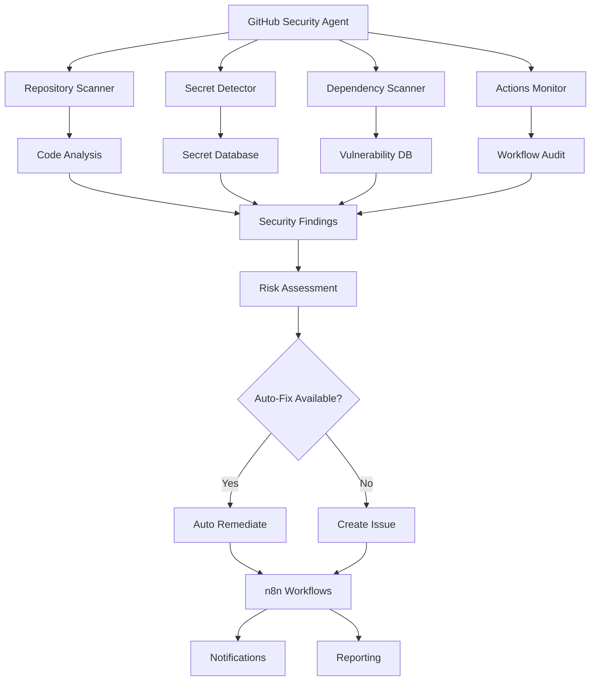

# GitHub Security Agent

Comprehensive GitHub security monitoring and protection system integrated with the n8n Cybersecurity Agent. Monitor repositories, detect secrets, scan dependencies, and automate security responses.

## Overview

The GitHub Security Agent provides:
- **Repository Scanning**: Scan all repositories for security issues
- **Secret Detection**: Find exposed API keys, tokens, and credentials
- **Dependency Scanning**: GitHub Dependabot integration
- **Code Security**: SAST (Static Application Security Testing)
- **Access Monitoring**: Track repository access and permissions
- **GitHub Actions Security**: Monitor CI/CD pipeline security
- **Branch Protection**: Enforce security policies
- **Security Alerts**: Real-time notifications
- **Automated Remediation**: Auto-fix security issues

## Architecture



## Features

### 1. Repository Security Scanning

Scan all repositories for security misconfigurations and vulnerabilities.

#### Implementation

```javascript
const { Octokit } = require('@octokit/rest');

class GitHubSecurityScanner {
  constructor(token) {
    this.octokit = new Octokit({ auth: token });
    this.findings = [];
  }

  /**
   * Scan all repositories
   */
  async scanAllRepositories(org) {
    try {
      const repos = await this.octokit.paginate(
        this.octokit.repos.listForOrg,
        { org: org, per_page: 100 }
      );

      console.log(`Scanning ${repos.length} repositories...`);

      for (const repo of repos) {
        await this.scanRepository(org, repo.name);
      }

      return this.generateReport();
    } catch (error) {
      console.error('Scan error:', error.message);
      throw error;
    }
  }

  /**
   * Scan individual repository
   */
  async scanRepository(owner, repo) {
    console.log(`Scanning ${owner}/${repo}...`);

    const findings = [];

    // Check repository settings
    const repoData = await this.octokit.repos.get({ owner, repo });
    findings.push(...this.checkRepositorySettings(repoData.data));

    // Check branch protection
    const branches = await this.octokit.repos.listBranches({ owner, repo });
    for (const branch of branches.data) {
      if (branch.name === 'main' || branch.name === 'master') {
        const protection = await this.checkBranchProtection(owner, repo, branch.name);
        findings.push(...protection);
      }
    }

    // Check secrets and variables
    const secrets = await this.scanSecrets(owner, repo);
    findings.push(...secrets);

    // Check GitHub Actions
    const actions = await this.scanActions(owner, repo);
    findings.push(...actions);

    // Check access permissions
    const access = await this.scanAccessPermissions(owner, repo);
    findings.push(...access);

    // Check dependencies
    const deps = await this.scanDependencies(owner, repo);
    findings.push(...deps);

    this.findings.push({
      repository: `${owner}/${repo}`,
      findings: findings,
      risk_score: this.calculateRiskScore(findings),
      scanned_at: new Date()
    });

    return findings;
  }

  /**
   * Check repository settings
   */
  checkRepositorySettings(repo) {
    const issues = [];

    // Check if repo is public but shouldn't be
    if (repo.private === false && repo.name.includes('internal')) {
      issues.push({
        type: 'public_repo',
        severity: 'HIGH',
        message: `Repository ${repo.name} is public but appears to be internal`,
        recommendation: 'Make repository private'
      });
    }

    // Check if vulnerability alerts are enabled
    if (!repo.security_and_analysis?.secret_scanning?.status === 'enabled') {
      issues.push({
        type: 'secret_scanning_disabled',
        severity: 'MEDIUM',
        message: 'Secret scanning is not enabled',
        recommendation: 'Enable secret scanning in repository settings'
      });
    }

    // Check if Dependabot is enabled
    if (!repo.security_and_analysis?.dependabot_security_updates?.status === 'enabled') {
      issues.push({
        type: 'dependabot_disabled',
        severity: 'MEDIUM',
        message: 'Dependabot security updates are not enabled',
        recommendation: 'Enable Dependabot security updates'
      });
    }

    // Check if wiki is enabled (potential info leak)
    if (repo.has_wiki) {
      issues.push({
        type: 'wiki_enabled',
        severity: 'LOW',
        message: 'Wiki is enabled (potential for sensitive info disclosure)',
        recommendation: 'Review wiki content or disable if not needed'
      });
    }

    // Check default branch name
    if (repo.default_branch === 'master') {
      issues.push({
        type: 'legacy_branch_name',
        severity: 'INFO',
        message: 'Repository uses "master" instead of "main"',
        recommendation: 'Consider renaming default branch to "main"'
      });
    }

    return issues;
  }

  /**
   * Check branch protection
   */
  async checkBranchProtection(owner, repo, branch) {
    const issues = [];

    try {
      const protection = await this.octokit.repos.getBranchProtection({
        owner,
        repo,
        branch
      });

      const rules = protection.data;

      // Check required reviews
      if (!rules.required_pull_request_reviews) {
        issues.push({
          type: 'no_required_reviews',
          severity: 'HIGH',
          branch: branch,
          message: `Branch ${branch} does not require pull request reviews`,
          recommendation: 'Enable required pull request reviews'
        });
      } else if (rules.required_pull_request_reviews.required_approving_review_count < 2) {
        issues.push({
          type: 'insufficient_reviews',
          severity: 'MEDIUM',
          branch: branch,
          message: `Branch ${branch} requires less than 2 approving reviews`,
          recommendation: 'Require at least 2 approving reviews'
        });
      }

      // Check if admins can bypass
      if (rules.enforce_admins?.enabled === false) {
        issues.push({
          type: 'admins_can_bypass',
          severity: 'MEDIUM',
          branch: branch,
          message: 'Administrators can bypass branch protection',
          recommendation: 'Enable admin enforcement'
        });
      }

      // Check required status checks
      if (!rules.required_status_checks) {
        issues.push({
          type: 'no_status_checks',
          severity: 'MEDIUM',
          branch: branch,
          message: 'No required status checks configured',
          recommendation: 'Configure required CI/CD checks'
        });
      }

    } catch (error) {
      if (error.status === 404) {
        issues.push({
          type: 'no_branch_protection',
          severity: 'CRITICAL',
          branch: branch,
          message: `Branch ${branch} has no protection rules`,
          recommendation: 'Enable branch protection immediately'
        });
      }
    }

    return issues;
  }

  /**
   * Scan for exposed secrets
   */
  async scanSecrets(owner, repo) {
    const issues = [];

    try {
      // Get secret scanning alerts
      const alerts = await this.octokit.secretScanning.listAlertsForRepo({
        owner,
        repo,
        state: 'open'
      });

      for (const alert of alerts.data) {
        issues.push({
          type: 'exposed_secret',
          severity: 'CRITICAL',
          secret_type: alert.secret_type,
          location: `${alert.html_url}`,
          message: `Exposed ${alert.secret_type} found in repository`,
          recommendation: 'Revoke and rotate the exposed secret immediately',
          created_at: alert.created_at
        });
      }

      // Scan repository files for common secrets patterns
      const fileSecrets = await this.scanFilesForSecrets(owner, repo);
      issues.push(...fileSecrets);

    } catch (error) {
      if (error.status !== 404) {
        console.error(`Error scanning secrets: ${error.message}`);
      }
    }

    return issues;
  }

  /**
   * Scan files for secret patterns
   */
  async scanFilesForSecrets(owner, repo) {
    const issues = [];
    const secretPatterns = [
      { name: 'AWS Access Key', pattern: /AKIA[0-9A-Z]{16}/g },
      { name: 'API Key', pattern: /api[_-]?key[_-]?[=:]\s*['"]?([a-zA-Z0-9]{32,})/gi },
      { name: 'Private Key', pattern: /-----BEGIN (RSA |EC )?PRIVATE KEY-----/g },
      { name: 'Password', pattern: /password[_-]?[=:]\s*['"]([^'"]+)['"]/gi },
      { name: 'Token', pattern: /token[_-]?[=:]\s*['"]([^'"]+)['"]/gi },
      { name: 'Database URL', pattern: /(mongodb|mysql|postgresql):\/\/[^\s]+/gi },
      { name: 'Slack Token', pattern: /xox[baprs]-[0-9]{10,12}-[0-9]{10,12}-[a-zA-Z0-9]{24,}/g },
      { name: 'GitHub Token', pattern: /gh[pousr]_[A-Za-z0-9_]{36,}/g }
    ];

    try {
      // Get repository tree
      const tree = await this.octokit.git.getTree({
        owner,
        repo,
        tree_sha: 'HEAD',
        recursive: true
      });

      // Files to check
      const filesToCheck = tree.data.tree.filter(item =>
        item.type === 'blob' &&
        (item.path.includes('config') ||
         item.path.includes('.env') ||
         item.path.endsWith('.json') ||
         item.path.endsWith('.yaml') ||
         item.path.endsWith('.yml'))
      );

      for (const file of filesToCheck.slice(0, 50)) { // Limit to 50 files
        try {
          const content = await this.octokit.repos.getContent({
            owner,
            repo,
            path: file.path
          });

          if (content.data.content) {
            const decoded = Buffer.from(content.data.content, 'base64').toString();

            for (const pattern of secretPatterns) {
              const matches = decoded.match(pattern.pattern);
              if (matches) {
                issues.push({
                  type: 'potential_secret',
                  severity: 'HIGH',
                  secret_type: pattern.name,
                  file: file.path,
                  message: `Potential ${pattern.name} found in ${file.path}`,
                  recommendation: 'Review and remove sensitive data, use environment variables'
                });
              }
            }
          }
        } catch (error) {
          // Skip files that can't be read
        }
      }
    } catch (error) {
      console.error(`Error scanning files: ${error.message}`);
    }

    return issues;
  }

  /**
   * Scan GitHub Actions workflows
   */
  async scanActions(owner, repo) {
    const issues = [];

    try {
      const workflows = await this.octokit.actions.listRepoWorkflows({
        owner,
        repo
      });

      for (const workflow of workflows.data.workflows) {
        // Get workflow file content
        const workflowFile = await this.octokit.repos.getContent({
          owner,
          repo,
          path: workflow.path
        });

        const content = Buffer.from(workflowFile.data.content, 'base64').toString();

        // Check for security issues in workflow

        // Check for pull_request_target with untrusted code execution
        if (content.includes('pull_request_target') && content.includes('${{ github.event')) {
          issues.push({
            type: 'unsafe_pr_target',
            severity: 'CRITICAL',
            workflow: workflow.name,
            message: 'Workflow uses pull_request_target with untrusted input',
            recommendation: 'Use pull_request instead or sanitize inputs'
          });
        }

        // Check for script injection
        if (content.match(/\$\{\{.*github\.event\.(issue|comment|pull_request).*\}\}/)) {
          issues.push({
            type: 'script_injection_risk',
            severity: 'HIGH',
            workflow: workflow.name,
            message: 'Workflow may be vulnerable to script injection',
            recommendation: 'Sanitize user inputs or use intermediate environment variables'
          });
        }

        // Check for secrets in workflow
        if (content.match(/password|token|key/i) && !content.includes('secrets.')) {
          issues.push({
            type: 'hardcoded_secret',
            severity: 'HIGH',
            workflow: workflow.name,
            message: 'Potential hardcoded secret in workflow',
            recommendation: 'Use GitHub Secrets for sensitive data'
          });
        }

        // Check for unpinned actions
        const unpinnedActions = content.match(/@(?!v?\d+\.?\d*\.?\d*$)(?![\w-]+\/[\w-]+@[a-f0-9]{40})/g);
        if (unpinnedActions) {
          issues.push({
            type: 'unpinned_action',
            severity: 'MEDIUM',
            workflow: workflow.name,
            message: 'Workflow uses unpinned third-party actions',
            recommendation: 'Pin actions to specific commit SHA or version tag'
          });
        }
      }
    } catch (error) {
      // Repository might not have actions
    }

    return issues;
  }

  /**
   * Scan access permissions
   */
  async scanAccessPermissions(owner, repo) {
    const issues = [];

    try {
      // Get collaborators
      const collaborators = await this.octokit.repos.listCollaborators({
        owner,
        repo
      });

      // Check for users with admin access
      const admins = collaborators.data.filter(c =>
        c.permissions.admin && c.type === 'User'
      );

      if (admins.length > 5) {
        issues.push({
          type: 'excessive_admins',
          severity: 'MEDIUM',
          message: `${admins.length} users have admin access`,
          recommendation: 'Review and reduce number of administrators'
        });
      }

      // Check for outside collaborators
      const outsiders = collaborators.data.filter(c =>
        c.permissions.admin && c.site_admin === false
      );

      if (outsiders.length > 0) {
        issues.push({
          type: 'outside_collaborators',
          severity: 'MEDIUM',
          message: `${outsiders.length} outside collaborators found`,
          recommendation: 'Review outside collaborator access'
        });
      }

    } catch (error) {
      console.error(`Error scanning permissions: ${error.message}`);
    }

    return issues;
  }

  /**
   * Scan dependencies for vulnerabilities
   */
  async scanDependencies(owner, repo) {
    const issues = [];

    try {
      // Get Dependabot alerts
      const alerts = await this.octokit.dependabot.listAlertsForRepo({
        owner,
        repo,
        state: 'open'
      });

      for (const alert of alerts.data) {
        issues.push({
          type: 'vulnerable_dependency',
          severity: this.mapDependabotSeverity(alert.security_advisory.severity),
          package: alert.security_advisory.package.name,
          vulnerability: alert.security_advisory.cve_id || alert.security_advisory.ghsa_id,
          message: `Vulnerable dependency: ${alert.security_advisory.summary}`,
          recommendation: `Update ${alert.security_advisory.package.name} to ${alert.security_advisory.patched_versions}`,
          cvss_score: alert.security_advisory.cvss?.score,
          created_at: alert.created_at
        });
      }

    } catch (error) {
      if (error.status !== 404 && error.status !== 403) {
        console.error(`Error scanning dependencies: ${error.message}`);
      }
    }

    return issues;
  }

  /**
   * Map Dependabot severity to our severity levels
   */
  mapDependabotSeverity(severity) {
    const mapping = {
      'critical': 'CRITICAL',
      'high': 'HIGH',
      'medium': 'MEDIUM',
      'low': 'LOW'
    };
    return mapping[severity.toLowerCase()] || 'MEDIUM';
  }

  /**
   * Calculate risk score for repository
   */
  calculateRiskScore(findings) {
    let score = 0;

    for (const finding of findings) {
      switch (finding.severity) {
        case 'CRITICAL':
          score += 10;
          break;
        case 'HIGH':
          score += 5;
          break;
        case 'MEDIUM':
          score += 2;
          break;
        case 'LOW':
          score += 1;
          break;
      }
    }

    return Math.min(score, 100);
  }

  /**
   * Generate comprehensive report
   */
  generateReport() {
    const critical = this.findings.reduce((sum, repo) =>
      sum + repo.findings.filter(f => f.severity === 'CRITICAL').length, 0
    );

    const high = this.findings.reduce((sum, repo) =>
      sum + repo.findings.filter(f => f.severity === 'HIGH').length, 0
    );

    return {
      summary: {
        repositories_scanned: this.findings.length,
        total_findings: this.findings.reduce((sum, r) => sum + r.findings.length, 0),
        critical_issues: critical,
        high_issues: high,
        average_risk_score: this.findings.reduce((sum, r) => sum + r.risk_score, 0) / this.findings.length
      },
      repositories: this.findings,
      top_risks: this.findings
        .sort((a, b) => b.risk_score - a.risk_score)
        .slice(0, 10),
      recommendations: this.generateRecommendations()
    };
  }

  /**
   * Generate recommendations
   */
  generateRecommendations() {
    const recommendations = [];

    // Count common issues
    const issueTypes = {};
    for (const repo of this.findings) {
      for (const finding of repo.findings) {
        issueTypes[finding.type] = (issueTypes[finding.type] || 0) + 1;
      }
    }

    // Generate recommendations for most common issues
    const sorted = Object.entries(issueTypes).sort((a, b) => b[1] - a[1]);

    for (const [type, count] of sorted.slice(0, 5)) {
      recommendations.push({
        issue: type,
        affected_repos: count,
        priority: 'HIGH',
        action: this.getRecommendationAction(type)
      });
    }

    return recommendations;
  }

  /**
   * Get recommendation action for issue type
   */
  getRecommendationAction(issueType) {
    const actions = {
      'no_branch_protection': 'Enable branch protection on all main branches',
      'exposed_secret': 'Revoke exposed secrets and implement secret scanning',
      'vulnerable_dependency': 'Enable Dependabot and update vulnerable dependencies',
      'unsafe_pr_target': 'Review and fix GitHub Actions workflows',
      'public_repo': 'Review repository visibility settings',
      'no_required_reviews': 'Require pull request reviews for all repositories'
    };

    return actions[issueType] || 'Review and remediate security finding';
  }
}

module.exports = GitHubSecurityScanner;
```

## n8n Workflow Integration

### Workflow: Automated GitHub Security Monitoring

```json
{
  "name": "GitHub Security Monitor",
  "nodes": [
    {
      "name": "Schedule - Daily 3 AM",
      "type": "n8n-nodes-base.scheduleTrigger",
      "parameters": {
        "rule": {
          "interval": [{ "field": "hours", "hoursInterval": 24 }]
        },
        "triggerAtHour": 3
      }
    },
    {
      "name": "Scan GitHub Organization",
      "type": "n8n-nodes-base.httpRequest",
      "parameters": {
        "url": "http://localhost:5678/api/v1/github/scan",
        "method": "POST",
        "body": {
          "organization": "your-org-name",
          "scan_type": "full"
        }
      }
    },
    {
      "name": "Check Critical Issues",
      "type": "n8n-nodes-base.switch",
      "parameters": {
        "conditions": {
          "number": [
            {
              "value1": "={{$json.summary.critical_issues}}",
              "operation": "larger",
              "value2": 0
            }
          ]
        }
      }
    },
    {
      "name": "CRITICAL - Immediate Action",
      "type": "n8n-nodes-base.code",
      "parameters": {
        "jsCode": "const criticalRepos = items[0].json.repositories\n  .filter(r => r.findings.some(f => f.severity === 'CRITICAL'))\n  .map(r => ({\n    repository: r.repository,\n    critical_issues: r.findings.filter(f => f.severity === 'CRITICAL'),\n    risk_score: r.risk_score\n  }));\n\nreturn criticalRepos.map(r => ({ json: r }));"
      }
    },
    {
      "name": "Alert Security Team",
      "type": "n8n-nodes-base.slack",
      "parameters": {
        "channel": "#security-critical",
        "text": "🚨 *CRITICAL GitHub Security Issues*\\n\\nRepository: {{$json.repository}}\\nRisk Score: {{$json.risk_score}}\\n\\nIssues:\\n{{$json.critical_issues.map(i => `• ${i.message}`).join('\\n')}}"
      }
    },
    {
      "name": "Create PagerDuty Incident",
      "type": "n8n-nodes-base.httpRequest",
      "parameters": {
        "url": "https://api.pagerduty.com/incidents",
        "method": "POST",
        "body": {
          "incident": {
            "type": "incident",
            "title": "Critical GitHub Security: {{$json.repository}}",
            "urgency": "high"
          }
        }
      }
    },
    {
      "name": "Auto-Fix Exposed Secrets",
      "type": "n8n-nodes-base.code",
      "parameters": {
        "jsCode": "const exposedSecrets = $json.critical_issues.filter(i => i.type === 'exposed_secret');\n\nfor (const secret of exposedSecrets) {\n  // Trigger secret rotation workflow\n  await $axios({\n    method: 'POST',\n    url: 'http://localhost:5678/api/v1/github/rotate-secret',\n    data: {\n      repository: $json.repository,\n      secret: secret\n    }\n  });\n}\n\nreturn [{ json: { rotated: exposedSecrets.length } }];"
      }
    },
    {
      "name": "Enable Branch Protection",
      "type": "n8n-nodes-base.httpRequest",
      "parameters": {
        "url": "http://localhost:5678/api/v1/github/enable-protection",
        "method": "POST",
        "body": {
          "repository": "={{$json.repository}}",
          "branch": "main",
          "rules": {
            "required_approving_review_count": 2,
            "enforce_admins": true,
            "required_status_checks": true
          }
        }
      }
    },
    {
      "name": "Create GitHub Issues",
      "type": "n8n-nodes-base.github",
      "parameters": {
        "operation": "createIssue",
        "owner": "={{$json.repository.split('/')[0]}}",
        "repo": "={{$json.repository.split('/')[1]}}",
        "title": "🔒 Security: {{$json.critical_issues[0].type}}",
        "body": "**Security Issue Detected**\\n\\nSeverity: CRITICAL\\n\\n{{$json.critical_issues[0].message}}\\n\\n**Recommendation:**\\n{{$json.critical_issues[0].recommendation}}",
        "labels": ["security", "critical"]
      }
    },
    {
      "name": "Generate Security Report",
      "type": "n8n-nodes-base.code",
      "parameters": {
        "jsCode": "const report = items[0].json;\n\nconst html = `\n<html>\n<head><style>\n  body { font-family: Arial, sans-serif; }\n  .critical { color: #d32f2f; }\n  .high { color: #f57c00; }\n  .summary { background: #f5f5f5; padding: 20px; }\n</style></head>\n<body>\n  <h1>GitHub Security Report</h1>\n  <div class=\"summary\">\n    <h2>Summary</h2>\n    <p>Repositories Scanned: ${report.summary.repositories_scanned}</p>\n    <p class=\"critical\">Critical Issues: ${report.summary.critical_issues}</p>\n    <p class=\"high\">High Issues: ${report.summary.high_issues}</p>\n    <p>Average Risk Score: ${report.summary.average_risk_score.toFixed(2)}</p>\n  </div>\n  \n  <h2>Top Risks</h2>\n  <ul>\n    ${report.top_risks.map(r => `\n      <li>\n        <strong>${r.repository}</strong> (Risk: ${r.risk_score})<br/>\n        Issues: ${r.findings.length}\n      </li>\n    `).join('')}\n  </ul>\n</body>\n</html>\n`;\n\nreturn [{ json: { report: report, html: html } }];"
      }
    },
    {
      "name": "Email Report",
      "type": "n8n-nodes-base.emailSend",
      "parameters": {
        "toEmail": "security-team@example.com",
        "subject": "Daily GitHub Security Report",
        "html": "={{$json.html}}"
      }
    },
    {
      "name": "Log to SIEM",
      "type": "n8n-nodes-base.httpRequest",
      "parameters": {
        "url": "http://localhost:5678/api/v1/siem/log",
        "method": "POST",
        "body": {
          "event_type": "github_security_scan",
          "data": "={{$json.report}}"
        }
      }
    }
  ],
  "connections": {
    "Schedule - Daily 3 AM": {
      "main": [[{ "node": "Scan GitHub Organization" }]]
    },
    "Scan GitHub Organization": {
      "main": [[{ "node": "Check Critical Issues" }]]
    },
    "Check Critical Issues": {
      "main": [
        [{ "node": "CRITICAL - Immediate Action" }],
        [{ "node": "Generate Security Report" }]
      ]
    },
    "CRITICAL - Immediate Action": {
      "main": [[
        { "node": "Alert Security Team" },
        { "node": "Create PagerDuty Incident" },
        { "node": "Auto-Fix Exposed Secrets" },
        { "node": "Enable Branch Protection" },
        { "node": "Create GitHub Issues" }
      ]]
    },
    "Alert Security Team": {
      "main": [[{ "node": "Generate Security Report" }]]
    },
    "Generate Security Report": {
      "main": [[
        { "node": "Email Report" },
        { "node": "Log to SIEM" }
      ]]
    }
  }
}
```

## API Endpoints

### Scan Organization

```http
POST /api/v1/github/scan
Content-Type: application/json

{
  "organization": "your-org",
  "scan_type": "full",
  "repositories": ["repo1", "repo2"]
}
```

### Get Security Alerts

```http
GET /api/v1/github/alerts?severity=critical&state=open
```

### Enable Branch Protection

```http
POST /api/v1/github/enable-protection
Content-Type: application/json

{
  "repository": "owner/repo",
  "branch": "main",
  "rules": {
    "required_approving_review_count": 2,
    "enforce_admins": true
  }
}
```

### Rotate Secret

```http
POST /api/v1/github/rotate-secret
Content-Type: application/json

{
  "repository": "owner/repo",
  "secret_name": "API_KEY",
  "new_value": "new_secret_value"
}
```

## Automated Remediation

### Auto-Enable Security Features

```javascript
class GitHubAutoRemediation {
  constructor(octokit) {
    this.octokit = octokit;
  }

  /**
   * Auto-enable security features
   */
  async enableSecurityFeatures(owner, repo) {
    const actions = [];

    try {
      // Enable secret scanning
      await this.octokit.repos.update({
        owner,
        repo,
        security_and_analysis: {
          secret_scanning: { status: 'enabled' },
          secret_scanning_push_protection: { status: 'enabled' }
        }
      });
      actions.push('Enabled secret scanning');

      // Enable Dependabot
      await this.octokit.repos.update({
        owner,
        repo,
        security_and_analysis: {
          dependabot_security_updates: { status: 'enabled' }
        }
      });
      actions.push('Enabled Dependabot');

      // Enable vulnerability alerts
      await this.octokit.repos.enableVulnerabilityAlerts({
        owner,
        repo
      });
      actions.push('Enabled vulnerability alerts');

    } catch (error) {
      console.error(`Error enabling features: ${error.message}`);
    }

    return actions;
  }

  /**
   * Auto-enable branch protection
   */
  async enableBranchProtection(owner, repo, branch = 'main') {
    try {
      await this.octokit.repos.updateBranchProtection({
        owner,
        repo,
        branch,
        required_status_checks: {
          strict: true,
          contexts: []
        },
        enforce_admins: true,
        required_pull_request_reviews: {
          required_approving_review_count: 2,
          dismiss_stale_reviews: true,
          require_code_owner_reviews: true
        },
        restrictions: null
      });

      return { success: true, message: `Branch protection enabled for ${branch}` };
    } catch (error) {
      return { success: false, error: error.message };
    }
  }

  /**
   * Auto-fix vulnerable dependencies
   */
  async fixVulnerableDependencies(owner, repo) {
    try {
      const alerts = await this.octokit.dependabot.listAlertsForRepo({
        owner,
        repo,
        state: 'open'
      });

      const fixed = [];

      for (const alert of alerts.data) {
        // Create a pull request to fix the vulnerability
        // This requires GitHub Advanced Security
        try {
          await this.octokit.dependabot.updateAlert({
            owner,
            repo,
            alert_number: alert.number,
            state: 'dismissed',
            dismissed_reason: 'fix_started'
          });

          fixed.push(alert);
        } catch (error) {
          console.error(`Error fixing alert ${alert.number}: ${error.message}`);
        }
      }

      return { fixed: fixed.length, total: alerts.data.length };
    } catch (error) {
      return { error: error.message };
    }
  }
}

module.exports = GitHubAutoRemediation;
```

## Security Best Practices

### 1. Token Security
- Use fine-grained personal access tokens
- Rotate tokens regularly
- Store tokens in n8n credentials manager
- Never commit tokens to repositories

### 2. Monitoring
- Enable secret scanning on all repositories
- Enable Dependabot security updates
- Monitor GitHub audit logs
- Set up security advisories

### 3. Access Control
- Use least privilege principle
- Enable 2FA for all users
- Review collaborator access regularly
- Use teams for permission management

### 4. Branch Protection
- Require pull request reviews
- Require status checks
- Enforce for administrators
- Protect main/master branches

### 5. Actions Security
- Pin actions to commit SHA
- Review third-party actions
- Use secrets for sensitive data
- Limit workflow permissions

## Integration with Other Security Tools

### SIEM Integration

```javascript
// Send GitHub security events to SIEM
async function sendToSIEM(event) {
  await axios.post('http://siem-server/api/events', {
    source: 'github-security-agent',
    event_type: event.type,
    severity: event.severity,
    data: event,
    timestamp: new Date().toISOString()
  });
}
```

### Jira Integration

```javascript
// Create Jira ticket for security findings
async function createJiraTicket(finding) {
  await axios.post('https://jira.example.com/rest/api/3/issue', {
    fields: {
      project: { key: 'SEC' },
      summary: `GitHub Security: ${finding.type}`,
      description: finding.message,
      issuetype: { name: 'Security Issue' },
      priority: { name: finding.severity }
    }
  });
}
```

## Metrics & Reporting

Track these metrics:
- Repositories scanned
- Critical/High/Medium/Low findings
- Average risk score
- Time to remediate
- Most common vulnerabilities
- Compliance score

## Next Steps

- [Token Manager](./token-manager.md)
- [AI Defense](./ai-defense.md)
- [Automation Workflows](./automation-workflows.md)
- [Integration Guide](./integration-guide.md)
