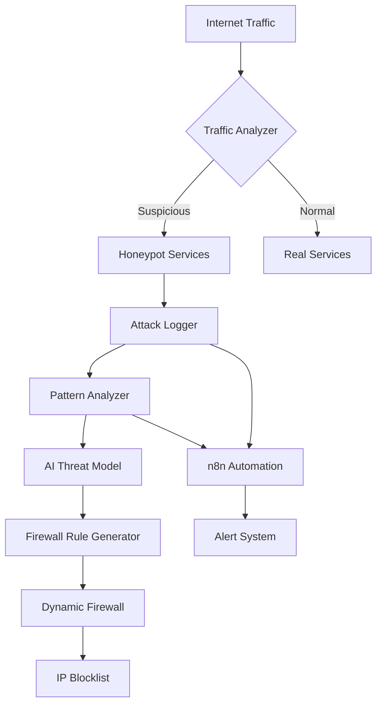

# Honeypot & Firewall System

The Honeypot and Firewall system provides intelligent threat detection by creating decoy services that attract and analyze attacker behavior while automatically blocking malicious traffic.

## Overview

The honeypot system creates realistic-looking vulnerable services that:
- Attract attackers away from real infrastructure
- Log attack techniques and patterns
- Feed attack data to AI learning systems
- Automatically generate firewall rules
- Block malicious IPs and patterns

## Architecture



## Honeypot Types

### 1. SSH Honeypot
Simulates SSH service to catch brute force attempts.

```javascript
const HoneypotSSH = require('./honeypots/ssh');

const sshHoneypot = new HoneypotSSH({
  port: 2222,
  banner: 'SSH-2.0-OpenSSH_7.4',
  logPath: '/var/log/honeypot/ssh.log',
  autoBlock: true,
  blockThreshold: 3 // Block after 3 failed attempts
});

sshHoneypot.on('login_attempt', (data) => {
  console.log(`SSH login attempt: ${data.username}@${data.ip}`);
  // Log to database
  // Update AI model
  // Generate firewall rule if threshold exceeded
});
```

### 2. HTTP API Honeypot
Fake REST API endpoints to catch automated scanners.

```javascript
const HoneypotHTTP = require('./honeypots/http');

const apiHoneypot = new HoneypotHTTP({
  port: 8080,
  endpoints: [
    '/api/admin',
    '/api/users',
    '/wp-admin', // Common WordPress attack target
    '/.env', // Environment file probe
    '/config.php'
  ]
});

apiHoneypot.on('access', (data) => {
  console.log(`Honeypot accessed: ${data.path} from ${data.ip}`);
  // Record attack pattern
});
```

### 3. Database Honeypot
Simulates MongoDB, MySQL, or PostgreSQL to catch database attacks.

```javascript
const HoneypotDB = require('./honeypots/database');

const dbHoneypot = new HoneypotDB({
  type: 'mongodb',
  port: 27017,
  fakeData: true, // Serve fake data
  logQueries: true
});

dbHoneypot.on('query', (data) => {
  console.log(`Database query attempt: ${data.query} from ${data.ip}`);
  // Analyze for SQL injection patterns
});
```

### 4. SMB/CIFS Honeypot
Detects ransomware and file sharing attacks.

```javascript
const HoneypotSMB = require('./honeypots/smb');

const smbHoneypot = new HoneypotSMB({
  port: 445,
  shares: ['Public', 'Documents', 'Backup'],
  canaryFiles: true // Include canary files to detect data exfiltration
});
```

## Firewall Integration

### Dynamic Firewall Rules

```javascript
class DynamicFirewall {
  constructor(config) {
    this.rules = new Map();
    this.blocklist = new Set();
    this.rateLimit = new Map();
  }

  /**
   * Add IP to blocklist
   */
  async blockIP(ip, reason, duration = 3600) {
    this.blocklist.add(ip);

    // Add iptables rule
    await this.executeCommand(`iptables -A INPUT -s ${ip} -j DROP`);

    // Store in database
    await this.logBlock({
      ip,
      reason,
      timestamp: new Date(),
      duration
    });

    // Auto-unblock after duration
    setTimeout(() => {
      this.unblockIP(ip);
    }, duration * 1000);
  }

  /**
   * Check if traffic should be allowed
   */
  async analyzeTraffic(request) {
    const ip = request.ip;

    // Check blocklist
    if (this.blocklist.has(ip)) {
      return { allow: false, reason: 'IP blocked' };
    }

    // Rate limiting
    const requestCount = this.rateLimit.get(ip) || 0;
    if (requestCount > 100) { // 100 requests per minute
      await this.blockIP(ip, 'Rate limit exceeded', 600);
      return { allow: false, reason: 'Rate limit exceeded' };
    }

    this.rateLimit.set(ip, requestCount + 1);

    // Pattern matching
    const threatScore = await this.calculateThreatScore(request);
    if (threatScore > 0.8) {
      return { allow: false, reason: 'High threat score', score: threatScore };
    }

    return { allow: true };
  }

  /**
   * Calculate threat score using AI
   */
  async calculateThreatScore(request) {
    // Analyze request headers
    const suspiciousHeaders = [
      'X-Forwarded-For',
      'X-Original-URL',
      'X-Rewrite-URL'
    ];

    let score = 0;

    // Check for suspicious patterns
    if (request.path.includes('..')) score += 0.3; // Path traversal
    if (request.path.includes('<script>')) score += 0.5; // XSS attempt
    if (request.path.includes('UNION SELECT')) score += 0.7; // SQL injection

    // Check user agent
    if (!request.headers['user-agent'] || request.headers['user-agent'].includes('bot')) {
      score += 0.2;
    }

    return Math.min(score, 1.0);
  }

  /**
   * Unblock IP
   */
  async unblockIP(ip) {
    this.blocklist.delete(ip);
    await this.executeCommand(`iptables -D INPUT -s ${ip} -j DROP`);
  }

  /**
   * Execute system command
   */
  async executeCommand(command) {
    const { exec } = require('child_process');
    return new Promise((resolve, reject) => {
      exec(command, (error, stdout, stderr) => {
        if (error) reject(error);
        else resolve(stdout);
      });
    });
  }

  /**
   * Get firewall statistics
   */
  getStats() {
    return {
      blockedIPs: this.blocklist.size,
      activeRules: this.rules.size,
      topBlockedIPs: this.getTopBlocked(10)
    };
  }
}

module.exports = DynamicFirewall;
```

## n8n Workflow Integration

### Workflow: Automated Honeypot Response

```json
{
  "name": "Honeypot Attack Response",
  "nodes": [
    {
      "name": "Webhook - Honeypot Alert",
      "type": "n8n-nodes-base.webhook",
      "parameters": {
        "path": "honeypot-alert",
        "responseMode": "onReceived",
        "httpMethod": "POST"
      }
    },
    {
      "name": "Analyze Attack Pattern",
      "type": "n8n-nodes-base.code",
      "parameters": {
        "jsCode": "// Analyze attack type and severity\nconst attackData = $json;\nconst severity = attackData.failedAttempts > 5 ? 'high' : 'medium';\n\nreturn [{\n  json: {\n    ip: attackData.ip,\n    attackType: attackData.type,\n    severity: severity,\n    timestamp: new Date().toISOString(),\n    failedAttempts: attackData.failedAttempts\n  }\n}];"
      }
    },
    {
      "name": "Check IP Reputation",
      "type": "n8n-nodes-base.httpRequest",
      "parameters": {
        "url": "https://api.abuseipdb.com/api/v2/check",
        "method": "GET",
        "queryParameters": {
          "ipAddress": "={{$json.ip}}",
          "maxAgeInDays": "90"
        },
        "headerParameters": {
          "Key": "={{$credentials.abuseIPDB.apiKey}}"
        }
      }
    },
    {
      "name": "Determine Action",
      "type": "n8n-nodes-base.switch",
      "parameters": {
        "conditions": {
          "number": [
            {
              "value1": "={{$json.abuseConfidenceScore}}",
              "operation": "larger",
              "value2": 75
            }
          ]
        }
      }
    },
    {
      "name": "Block IP - Firewall",
      "type": "n8n-nodes-base.httpRequest",
      "parameters": {
        "url": "http://localhost:5678/api/v1/firewall/block",
        "method": "POST",
        "body": {
          "ip": "={{$json.ip}}",
          "reason": "Honeypot attack + high abuse score",
          "duration": 86400
        }
      }
    },
    {
      "name": "Log to Security DB",
      "type": "n8n-nodes-base.postgres",
      "parameters": {
        "operation": "insert",
        "table": "security_incidents",
        "columns": "ip,attack_type,severity,timestamp,action_taken"
      }
    },
    {
      "name": "Alert Security Team",
      "type": "n8n-nodes-base.slack",
      "parameters": {
        "channel": "#security-alerts",
        "text": "🚨 *Security Alert*\n\nIP: {{$json.ip}}\nAttack Type: {{$json.attackType}}\nSeverity: {{$json.severity}}\nAbuse Score: {{$json.abuseConfidenceScore}}\n\nAction: IP Blocked for 24 hours"
      }
    },
    {
      "name": "Update AI Model",
      "type": "n8n-nodes-base.httpRequest",
      "parameters": {
        "url": "http://localhost:5678/api/v1/ai/train",
        "method": "POST",
        "body": {
          "attackPattern": "={{$json}}",
          "label": "malicious"
        }
      }
    }
  ],
  "connections": {
    "Webhook - Honeypot Alert": {
      "main": [[{ "node": "Analyze Attack Pattern" }]]
    },
    "Analyze Attack Pattern": {
      "main": [[{ "node": "Check IP Reputation" }]]
    },
    "Check IP Reputation": {
      "main": [[{ "node": "Determine Action" }]]
    },
    "Determine Action": {
      "main": [
        [{ "node": "Block IP - Firewall" }],
        [{ "node": "Log to Security DB" }]
      ]
    },
    "Block IP - Firewall": {
      "main": [
        [
          { "node": "Log to Security DB" },
          { "node": "Alert Security Team" },
          { "node": "Update AI Model" }
        ]
      ]
    }
  }
}
```

## API Reference

### Block IP

**Endpoint**: `POST /api/v1/firewall/block`

**Request**:
```json
{
  "ip": "192.168.1.100",
  "reason": "Multiple SSH brute force attempts",
  "duration": 3600
}
```

### Unblock IP

**Endpoint**: `POST /api/v1/firewall/unblock`

**Request**:
```json
{
  "ip": "192.168.1.100"
}
```

### Get Blocked IPs

**Endpoint**: `GET /api/v1/firewall/blocked`

**Response**:
```json
{
  "blockedIPs": [
    {
      "ip": "192.168.1.100",
      "reason": "SSH brute force",
      "blockedAt": "2025-12-06T10:00:00Z",
      "expiresAt": "2025-12-06T11:00:00Z"
    }
  ],
  "total": 1
}
```

### Get Honeypot Logs

**Endpoint**: `GET /api/v1/honeypot/logs`

**Query Parameters**:
- `type`: ssh, http, db, smb
- `startDate`: ISO date
- `endDate`: ISO date
- `limit`: number of records

**Response**:
```json
{
  "logs": [
    {
      "id": "log_123",
      "type": "ssh",
      "ip": "1.2.3.4",
      "timestamp": "2025-12-06T10:30:00Z",
      "details": {
        "username": "admin",
        "password": "password123",
        "port": 2222
      }
    }
  ],
  "total": 100
}
```

## Advanced Honeypot Techniques

### Adaptive Responses

Make honeypots more convincing by adapting to attacker behavior:

```javascript
class AdaptiveHoneypot {
  constructor() {
    this.attackerProfiles = new Map();
  }

  /**
   * Learn attacker behavior and adapt responses
   */
  async handleInteraction(ip, action) {
    let profile = this.attackerProfiles.get(ip) || {
      attempts: 0,
      techniques: [],
      sophistication: 'low'
    };

    profile.attempts++;
    profile.techniques.push(action.type);

    // Determine sophistication level
    if (action.type === 'sql_injection' && action.advanced) {
      profile.sophistication = 'high';
    }

    this.attackerProfiles.set(ip, profile);

    // Adapt response based on sophistication
    if (profile.sophistication === 'high') {
      // Keep them engaged longer to learn more
      return this.generateRealisticResponse(action);
    } else {
      // Basic attacker - simple response
      return this.generateBasicResponse(action);
    }
  }
}
```

### Canary Tokens

Deploy canary files and tokens to detect data exfiltration:

```javascript
class CanaryToken {
  /**
   * Generate unique canary token
   */
  static generate(type, callback) {
    const token = crypto.randomBytes(32).toString('hex');
    const canaryURL = `https://canary.example.com/${token}`;

    // Store callback for when token is triggered
    database.storeCanary({
      token,
      type,
      callback,
      created: new Date()
    });

    return canaryURL;
  }

  /**
   * Create canary file
   */
  static createFile(filename, location) {
    const token = this.generate('file', async (data) => {
      await alertSecurityTeam({
        type: 'Canary File Accessed',
        file: filename,
        ip: data.ip,
        timestamp: new Date()
      });
    });

    const content = `
    # CONFIDENTIAL - Internal Use Only
    # Database Credentials
    DB_HOST=internal-db.example.com
    DB_USER=admin
    DB_PASS=canary_${token}
    `;

    fs.writeFileSync(`${location}/${filename}`, content);
  }
}
```

## Deployment

### Docker Deployment

```yaml
version: '3.8'

services:
  honeypot-ssh:
    image: n8n-cybersecurity/honeypot-ssh:latest
    ports:
      - "2222:22"
    environment:
      - LOG_LEVEL=info
      - AUTO_BLOCK=true
    volumes:
      - ./logs:/var/log/honeypot

  honeypot-http:
    image: n8n-cybersecurity/honeypot-http:latest
    ports:
      - "8080:80"
    environment:
      - ENDPOINTS=/api/admin,/wp-admin,/.env

  firewall:
    image: n8n-cybersecurity/firewall:latest
    network_mode: host
    privileged: true
    environment:
      - REDIS_URL=redis://redis:6379
      - AUTO_BLOCK_THRESHOLD=3

  redis:
    image: redis:alpine
    ports:
      - "6379:6379"
```

## Monitoring & Alerts

### Real-time Dashboard Metrics

- Active honeypots
- Attacks per hour
- Blocked IPs count
- Top attack types
- Geographic distribution of attacks
- Most targeted honeypot services

### Alert Triggers

1. **High-severity attacks**: Immediate Slack/Email alert
2. **Repeat offenders**: IP blocked for 24+ hours
3. **New attack patterns**: Alert security team for analysis
4. **Canary token triggered**: Critical alert - potential breach

## Best Practices

1. **Isolate Honeypots**: Run on separate network segment
2. **Regular Updates**: Keep honeypot software updated
3. **Realistic Configuration**: Make honeypots convincing
4. **Legal Compliance**: Ensure honeypot deployment complies with local laws
5. **Data Retention**: Store attack logs for forensic analysis
6. **Integration**: Feed data to SIEM and AI systems

## Next Steps

- [AI Attack Detection](./ai-defense.md)
- [Network Scanner Setup](./network-scanner.md)
- [Vulnerability Management](./vulnerability-scanner.md)
