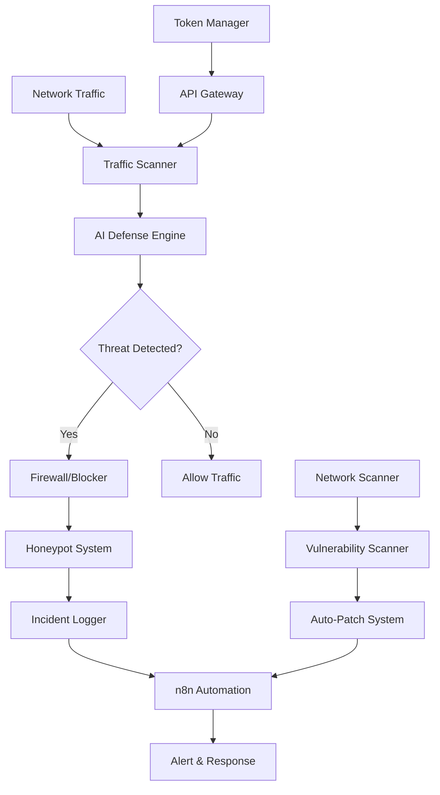

# Cybersecurity Agent for n8n

The n8n Cybersecurity Agent is a comprehensive security framework that provides real-time threat detection, network monitoring, and automated defense mechanisms for your n8n workflows and infrastructure.

## Overview

This cybersecurity agent integrates multiple security layers to protect your automation workflows:

- **AI-Powered Threat Detection**: Machine learning-based attack pattern recognition
- **Real-Time Traffic Monitoring**: Network traffic analysis and anomaly detection
- **Token Management**: Secure token generation, validation, and lifecycle management
- **Honeypot & Firewall**: Intelligent trap systems and firewall rules
- **Network Scanning**: WiFi, BLE, NFC, and API endpoint scanning
- **Vulnerability Management**: Automated scanning and patching
- **Remote Access Control**: Block and monitor unauthorized access attempts
- **GitHub Security**: Repository scanning, secret detection, and compliance monitoring
- **Automated Incident Response**: n8n-powered security automation

## Architecture



## Features

### 1. AI Attack Detection & Defense
- Real-time pattern recognition for DDoS, SQL injection, XSS
- Behavioral analysis of API requests
- Machine learning model for zero-day threat detection
- Automated blocking and quarantine

### 2. Token Manager
- JWT token generation and validation
- Token rotation and expiration management
- API key tracking and monitoring
- Session management with security policies

### 3. Network Monitoring
- **WiFi**: Monitor wireless networks for rogue access points
- **BLE (Bluetooth Low Energy)**: Detect unauthorized BLE devices
- **NFC**: Track NFC communication attempts
- **API Endpoints**: Scan and monitor all API endpoints

### 4. Honeypot System
- Decoy services to attract attackers
- Log attack patterns and techniques
- Feed data to AI learning system
- Automatic IP blocking

### 5. Firewall & Access Control
- Dynamic firewall rule generation
- Geo-blocking capabilities
- Rate limiting per IP/endpoint
- Remote access monitoring and blocking

### 6. Vulnerability Scanner
- CVE database integration
- Dependency vulnerability scanning
- Configuration security audit
- Automated patching recommendations

### 7. GitHub Security Agent
- Repository security scanning
- Secret and credential detection
- Dependabot integration
- GitHub Actions security monitoring
- Branch protection enforcement
- Automated remediation

## Quick Start

### Prerequisites
- n8n instance (self-hosted or cloud)
- Node.js 18+
- Redis (for token caching)
- PostgreSQL (for security logs)

### Installation

1. **Install the cybersecurity agent package**:
```bash
npm install @n8n-io/cybersecurity-agent
```

2. **Configure environment variables**:
```bash
export CYBER_AGENT_ENABLED=true
export CYBER_AGENT_AI_MODEL=gpt-4
export CYBER_AGENT_HONEYPOT_ENABLED=true
export CYBER_AGENT_FIREWALL_MODE=auto
export CYBER_AGENT_TOKEN_SECRET=your-secret-key
```

3. **Initialize the agent**:
```bash
npx cyber-agent init
```

## Integration with n8n Workflows

See detailed guides:
- [⚡ Quick Deploy Guide](./quick-deploy.md) - **START HERE for immediate deployment!**
- [Token Management API](./token-manager.md)
- [AI Defense Configuration](./ai-defense.md)
- [Network Scanner Setup](./network-scanner.md)
- [Honeypot Deployment](./honeypot.md)
- [GitHub Security Agent](./github-security.md)
- [Automated Response Workflows](./automation-workflows.md)
- [Vulnerability Management](./vulnerability-scanner.md)
- [Ethical Hacking & Testing](./ethical-hacking.md)

## Security Best Practices

1. **Rotate Tokens Regularly**: Use automated token rotation every 24-48 hours
2. **Monitor Logs**: Set up real-time alerting for security events
3. **Update Regularly**: Keep the agent and dependencies updated
4. **Test Defenses**: Run regular penetration tests using the simulation module
5. **Backup Security Data**: Maintain encrypted backups of security logs

## Support

For issues or questions:
- GitHub: [n8n-cybersecurity-agent](https://github.com/n8n-io/cybersecurity-agent)
- Community: [n8n Community Forum](https://community.n8n.io)
- Documentation: [Full API Reference](./api-reference.md)

## License

Enterprise Security License - See [LICENSE.md](./LICENSE.md)
