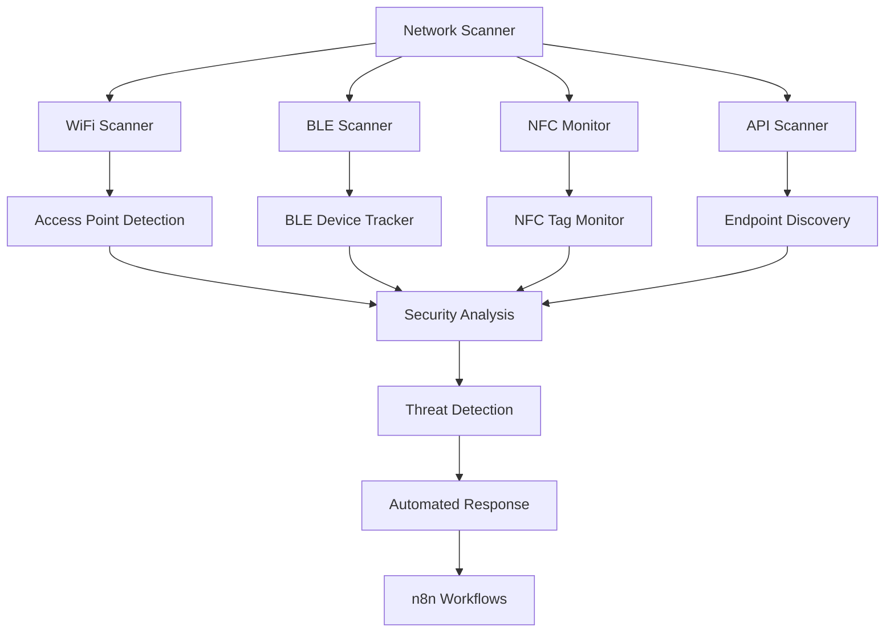

# Network Scanner - WiFi, BLE, NFC & API Monitoring

Comprehensive network scanning system to monitor and secure WiFi, Bluetooth Low Energy (BLE), NFC communications, and API endpoints in real-time.

## Overview

The Network Scanner provides:
- **WiFi Scanning**: Monitor wireless networks, detect rogue access points
- **BLE Scanning**: Detect and track Bluetooth Low Energy devices
- **NFC Monitoring**: Track NFC communication and tag interactions
- **API Endpoint Discovery**: Scan and monitor all API endpoints
- **Remote Access Monitoring**: Detect unauthorized remote connections
- **Network Traffic Analysis**: Deep packet inspection
- **Geolocation Tracking**: Track device locations

## Architecture



## WiFi Scanner

### Features
- Detect all nearby WiFi networks
- Identify rogue access points
- Monitor signal strength and encryption
- Track connected devices
- Detect evil twin attacks
- Alert on new/suspicious networks

### Implementation

```javascript
const wifi = require('node-wifi');
const EventEmitter = require('events');

class WiFiScanner extends EventEmitter {
  constructor(options = {}) {
    super();
    this.scanInterval = options.scanInterval || 30000; // 30 seconds
    this.knownNetworks = new Set();
    this.suspiciousPatterns = [
      /free.*wifi/i,
      /public.*wifi/i,
      /guest/i
    ];
  }

  /**
   * Initialize WiFi scanner
   */
  async initialize() {
    wifi.init({
      iface: null // Use default interface
    });

    console.log('WiFi Scanner initialized');
    this.startScanning();
  }

  /**
   * Start continuous scanning
   */
  startScanning() {
    this.scanWiFiNetworks();
    this.intervalId = setInterval(() => {
      this.scanWiFiNetworks();
    }, this.scanInterval);
  }

  /**
   * Scan for WiFi networks
   */
  async scanWiFiNetworks() {
    try {
      const networks = await wifi.scan();

      for (const network of networks) {
        await this.analyzeNetwork(network);
      }

      this.emit('scan_complete', {
        timestamp: new Date(),
        networksFound: networks.length,
        networks: networks
      });

    } catch (error) {
      this.emit('scan_error', error);
    }
  }

  /**
   * Analyze network for security threats
   */
  async analyzeNetwork(network) {
    const threats = [];

    // Check encryption
    if (!network.security || network.security === 'NONE') {
      threats.push({
        type: 'open_network',
        severity: 'medium',
        message: 'Unencrypted network detected'
      });
    }

    // Check for weak encryption
    if (network.security && network.security.includes('WEP')) {
      threats.push({
        type: 'weak_encryption',
        severity: 'high',
        message: 'WEP encryption detected (easily crackable)'
      });
    }

    // Check for suspicious SSID
    for (const pattern of this.suspiciousPatterns) {
      if (pattern.test(network.ssid)) {
        threats.push({
          type: 'suspicious_ssid',
          severity: 'high',
          message: `Suspicious network name: ${network.ssid}`
        });
      }
    }

    // Check for evil twin (same SSID as known network but different BSSID)
    if (this.knownNetworks.has(network.ssid)) {
      const knownNetwork = Array.from(this.knownNetworks).find(n => n.ssid === network.ssid);
      if (knownNetwork && knownNetwork.bssid !== network.bssid) {
        threats.push({
          type: 'evil_twin',
          severity: 'critical',
          message: `Possible evil twin attack: ${network.ssid}`
        });
      }
    }

    // Store known network
    this.knownNetworks.add({
      ssid: network.ssid,
      bssid: network.bssid,
      firstSeen: new Date()
    });

    if (threats.length > 0) {
      this.emit('threat_detected', {
        network: network,
        threats: threats,
        timestamp: new Date()
      });
    }

    return threats;
  }

  /**
   * Get current WiFi connection info
   */
  async getCurrentConnection() {
    return await wifi.getCurrentConnections();
  }

  /**
   * Stop scanning
   */
  stopScanning() {
    if (this.intervalId) {
      clearInterval(this.intervalId);
    }
  }
}

module.exports = WiFiScanner;
```

## BLE (Bluetooth Low Energy) Scanner

### Features
- Discover BLE devices in range
- Track device movements
- Detect unauthorized devices
- Monitor BLE advertisements
- Alert on suspicious devices

### Implementation

```javascript
const noble = require('@abandonware/noble');

class BLEScanner extends EventEmitter {
  constructor(options = {}) {
    super();
    this.knownDevices = new Map();
    this.whitelist = new Set(options.whitelist || []);
    this.trackingEnabled = options.trackingEnabled !== false;
  }

  /**
   * Initialize BLE scanner
   */
  initialize() {
    noble.on('stateChange', async (state) => {
      if (state === 'poweredOn') {
        console.log('BLE Scanner started');
        await noble.startScanningAsync([], true); // Scan all services, allow duplicates
      }
    });

    noble.on('discover', (peripheral) => {
      this.handleDiscoveredDevice(peripheral);
    });
  }

  /**
   * Handle discovered BLE device
   */
  handleDiscoveredDevice(peripheral) {
    const deviceInfo = {
      id: peripheral.id,
      address: peripheral.address,
      addressType: peripheral.addressType,
      name: peripheral.advertisement.localName || 'Unknown',
      rssi: peripheral.rssi,
      timestamp: new Date(),
      manufacturer: this.parseManufacturerData(peripheral.advertisement.manufacturerData),
      services: peripheral.advertisement.serviceUuids || []
    };

    // Check if device is known
    if (!this.knownDevices.has(deviceInfo.id)) {
      this.emit('new_device', deviceInfo);

      // Check if device is whitelisted
      if (!this.whitelist.has(deviceInfo.id)) {
        this.emit('unauthorized_device', {
          ...deviceInfo,
          threat: 'Unknown BLE device detected'
        });
      }
    }

    // Update device tracking
    if (this.trackingEnabled) {
      this.updateDeviceTracking(deviceInfo);
    }

    // Store device
    this.knownDevices.set(deviceInfo.id, deviceInfo);
  }

  /**
   * Parse manufacturer data
   */
  parseManufacturerData(data) {
    if (!data || data.length < 2) return null;

    const companyId = data.readUInt16LE(0);
    const companyData = data.slice(2);

    return {
      companyId: companyId,
      companyName: this.getCompanyName(companyId),
      data: companyData.toString('hex')
    };
  }

  /**
   * Get company name from ID
   */
  getCompanyName(companyId) {
    const companies = {
      0x004C: 'Apple Inc.',
      0x0006: 'Microsoft',
      0x00E0: 'Google',
      0x0075: 'Samsung Electronics'
    };
    return companies[companyId] || `Unknown (${companyId.toString(16)})`;
  }

  /**
   * Update device tracking
   */
  updateDeviceTracking(deviceInfo) {
    const existingDevice = this.knownDevices.get(deviceInfo.id);

    if (existingDevice) {
      // Calculate distance based on RSSI (approximate)
      const distance = this.calculateDistance(deviceInfo.rssi);

      // Detect if device is moving closer (possible attack)
      if (existingDevice.rssi && deviceInfo.rssi > existingDevice.rssi + 10) {
        this.emit('device_approaching', {
          ...deviceInfo,
          distance: distance,
          previousDistance: this.calculateDistance(existingDevice.rssi)
        });
      }

      // Update last seen
      existingDevice.lastSeen = new Date();
      existingDevice.rssi = deviceInfo.rssi;
      existingDevice.seenCount = (existingDevice.seenCount || 0) + 1;
    }
  }

  /**
   * Calculate approximate distance from RSSI
   */
  calculateDistance(rssi, txPower = -59) {
    if (rssi === 0) return -1;

    const ratio = rssi * 1.0 / txPower;
    if (ratio < 1.0) {
      return Math.pow(ratio, 10);
    } else {
      return (0.89976) * Math.pow(ratio, 7.7095) + 0.111;
    }
  }

  /**
   * Get all discovered devices
   */
  getDiscoveredDevices() {
    return Array.from(this.knownDevices.values());
  }

  /**
   * Stop scanning
   */
  async stop() {
    await noble.stopScanningAsync();
  }
}

module.exports = BLEScanner;
```

## NFC Monitor

### Features
- Monitor NFC tag reads/writes
- Track NFC device interactions
- Detect unauthorized NFC access
- Log NFC transactions
- Alert on suspicious NFC activity

### Implementation

```javascript
const { NFC } = require('nfc-pcsc');

class NFCMonitor extends EventEmitter {
  constructor(options = {}) {
    super();
    this.nfc = new NFC();
    this.authorizedTags = new Set(options.authorizedTags || []);
    this.transactions = [];
  }

  /**
   * Initialize NFC monitor
   */
  initialize() {
    this.nfc.on('reader', reader => {
      console.log(`NFC Reader detected: ${reader.reader.name}`);

      reader.on('card', card => {
        this.handleNFCCard(card, reader);
      });

      reader.on('card.off', card => {
        this.emit('card_removed', {
          uid: card.uid,
          timestamp: new Date()
        });
      });

      reader.on('error', err => {
        this.emit('reader_error', err);
      });
    });

    this.nfc.on('error', err => {
      this.emit('nfc_error', err);
    });
  }

  /**
   * Handle NFC card detection
   */
  async handleNFCCard(card, reader) {
    const cardInfo = {
      uid: card.uid,
      type: card.type,
      atr: card.atr,
      timestamp: new Date(),
      readerName: reader.reader.name
    };

    // Check if tag is authorized
    const isAuthorized = this.authorizedTags.has(card.uid);

    if (!isAuthorized) {
      this.emit('unauthorized_tag', {
        ...cardInfo,
        threat: 'Unauthorized NFC tag detected'
      });
    }

    // Try to read data
    try {
      const data = await this.readNFCData(card, reader);
      cardInfo.data = data;
    } catch (error) {
      cardInfo.readError = error.message;
    }

    // Log transaction
    this.transactions.push(cardInfo);

    this.emit('card_detected', cardInfo);

    // Analyze for threats
    await this.analyzeNFCThreat(cardInfo);
  }

  /**
   * Read data from NFC tag
   */
  async readNFCData(card, reader) {
    try {
      // Read NDEF message
      const data = await reader.read(0, 16);
      return {
        raw: data.toString('hex'),
        text: data.toString('utf8').replace(/\0/g, '')
      };
    } catch (error) {
      throw new Error(`Failed to read NFC data: ${error.message}`);
    }
  }

  /**
   * Analyze NFC interaction for threats
   */
  async analyzeNFCThreat(cardInfo) {
    const threats = [];

    // Check for repeated access attempts
    const recentAccess = this.transactions.filter(t =>
      t.uid === cardInfo.uid &&
      (new Date() - t.timestamp) < 60000 // Last minute
    );

    if (recentAccess.length > 5) {
      threats.push({
        type: 'repeated_access',
        severity: 'medium',
        message: 'Multiple NFC access attempts detected'
      });
    }

    // Check for data manipulation attempts
    if (cardInfo.data && cardInfo.data.raw.includes('ffffffff')) {
      threats.push({
        type: 'possible_cloning',
        severity: 'high',
        message: 'Possible NFC tag cloning attempt'
      });
    }

    if (threats.length > 0) {
      this.emit('nfc_threat', {
        card: cardInfo,
        threats: threats
      });
    }

    return threats;
  }

  /**
   * Get transaction history
   */
  getTransactions(limit = 100) {
    return this.transactions.slice(-limit);
  }
}

module.exports = NFCMonitor;
```

## API Scanner

### Features
- Discover all API endpoints
- Monitor API usage and patterns
- Detect API abuse
- Track API keys and tokens
- Scan for API vulnerabilities
- Rate limiting enforcement

### Implementation

```javascript
const axios = require('axios');
const URL = require('url').URL;

class APIScanner {
  constructor(baseURL, options = {}) {
    this.baseURL = baseURL;
    this.discoveredEndpoints = new Set();
    this.endpointMetrics = new Map();
    this.vulnerabilities = [];
  }

  /**
   * Scan for API endpoints
   */
  async scanEndpoints(paths = []) {
    const commonPaths = [
      '/api',
      '/api/v1',
      '/api/v2',
      '/graphql',
      '/rest',
      '/api/users',
      '/api/admin',
      '/api/auth',
      '/api/data',
      '/api/config',
      '/api/health',
      '/api/metrics',
      '/swagger',
      '/api-docs',
      '/.well-known'
    ];

    const pathsToScan = [...commonPaths, ...paths];

    for (const path of pathsToScan) {
      await this.probeEndpoint(path);
    }

    return Array.from(this.discoveredEndpoints);
  }

  /**
   * Probe individual endpoint
   */
  async probeEndpoint(path) {
    const url = new URL(path, this.baseURL).toString();

    try {
      const methods = ['GET', 'POST', 'PUT', 'DELETE', 'PATCH', 'OPTIONS'];

      for (const method of methods) {
        try {
          const response = await axios({
            method: method,
            url: url,
            timeout: 5000,
            validateStatus: () => true // Accept any status
          });

          if (response.status !== 404) {
            this.discoveredEndpoints.add({
              path: path,
              method: method,
              status: response.status,
              headers: response.headers,
              discoveredAt: new Date()
            });

            // Check for security headers
            await this.checkSecurityHeaders(response, path, method);

            // Check for information disclosure
            await this.checkInformationDisclosure(response, path);
          }
        } catch (error) {
          // Endpoint exists but errored
          if (error.response) {
            this.discoveredEndpoints.add({
              path: path,
              method: method,
              status: error.response.status,
              error: true
            });
          }
        }
      }
    } catch (error) {
      console.error(`Error probing ${path}:`, error.message);
    }
  }

  /**
   * Check security headers
   */
  async checkSecurityHeaders(response, path, method) {
    const requiredHeaders = [
      'x-content-type-options',
      'x-frame-options',
      'strict-transport-security',
      'content-security-policy'
    ];

    const missingHeaders = requiredHeaders.filter(
      header => !response.headers[header]
    );

    if (missingHeaders.length > 0) {
      this.vulnerabilities.push({
        type: 'missing_security_headers',
        severity: 'medium',
        path: path,
        method: method,
        details: `Missing headers: ${missingHeaders.join(', ')}`
      });
    }

    // Check for sensitive data in headers
    const sensitiveHeaders = ['x-powered-by', 'server'];
    for (const header of sensitiveHeaders) {
      if (response.headers[header]) {
        this.vulnerabilities.push({
          type: 'information_disclosure',
          severity: 'low',
          path: path,
          details: `Header ${header} exposes: ${response.headers[header]}`
        });
      }
    }
  }

  /**
   * Check for information disclosure
   */
  async checkInformationDisclosure(response, path) {
    const data = JSON.stringify(response.data);

    // Check for stack traces
    if (data.includes('stack') || data.includes('stackTrace')) {
      this.vulnerabilities.push({
        type: 'stack_trace_disclosure',
        severity: 'high',
        path: path,
        details: 'Stack trace exposed in response'
      });
    }

    // Check for database errors
    if (data.match(/sql|mysql|postgres|mongodb/i)) {
      this.vulnerabilities.push({
        type: 'database_error_disclosure',
        severity: 'high',
        path: path,
        details: 'Database error information exposed'
      });
    }

    // Check for API keys or secrets
    const secretPatterns = [
      /api[_-]?key/i,
      /secret/i,
      /password/i,
      /token/i,
      /[a-f0-9]{32,}/i // Hex strings (possible tokens)
    ];

    for (const pattern of secretPatterns) {
      if (pattern.test(data)) {
        this.vulnerabilities.push({
          type: 'possible_secret_exposure',
          severity: 'critical',
          path: path,
          details: `Possible secret/key exposure matching pattern: ${pattern}`
        });
      }
    }
  }

  /**
   * Test for common API vulnerabilities
   */
  async testVulnerabilities(endpoint) {
    const tests = [
      this.testSQLInjection.bind(this),
      this.testXSS.bind(this),
      this.testRateLimiting.bind(this),
      this.testAuthentication.bind(this),
      this.testAuthorization.bind(this)
    ];

    for (const test of tests) {
      await test(endpoint);
    }
  }

  /**
   * Test for SQL injection
   */
  async testSQLInjection(endpoint) {
    const payloads = [
      "' OR '1'='1",
      "1' OR '1' = '1",
      "admin'--",
      "' UNION SELECT NULL--"
    ];

    for (const payload of payloads) {
      try {
        const response = await axios.get(endpoint.path, {
          params: { id: payload },
          baseURL: this.baseURL
        });

        // Check for SQL errors in response
        const data = JSON.stringify(response.data);
        if (data.match(/sql|syntax|mysql|postgres/i)) {
          this.vulnerabilities.push({
            type: 'sql_injection',
            severity: 'critical',
            path: endpoint.path,
            payload: payload,
            details: 'Possible SQL injection vulnerability'
          });
          break;
        }
      } catch (error) {
        // Error might indicate vulnerability
      }
    }
  }

  /**
   * Test for XSS
   */
  async testXSS(endpoint) {
    const payload = '<script>alert(1)</script>';

    try {
      const response = await axios.post(endpoint.path, {
        data: payload
      }, {
        baseURL: this.baseURL
      });

      if (JSON.stringify(response.data).includes(payload)) {
        this.vulnerabilities.push({
          type: 'xss',
          severity: 'high',
          path: endpoint.path,
          details: 'Possible XSS vulnerability - unescaped user input'
        });
      }
    } catch (error) {
      // Ignore errors
    }
  }

  /**
   * Test rate limiting
   */
  async testRateLimiting(endpoint) {
    const requests = [];
    const requestCount = 100;

    for (let i = 0; i < requestCount; i++) {
      requests.push(
        axios.get(endpoint.path, {
          baseURL: this.baseURL,
          validateStatus: () => true
        })
      );
    }

    try {
      const responses = await Promise.all(requests);
      const rateLimited = responses.filter(r => r.status === 429);

      if (rateLimited.length === 0) {
        this.vulnerabilities.push({
          type: 'missing_rate_limiting',
          severity: 'medium',
          path: endpoint.path,
          details: 'No rate limiting detected'
        });
      }
    } catch (error) {
      // Error occurred
    }
  }

  /**
   * Get scan results
   */
  getResults() {
    return {
      endpoints: Array.from(this.discoveredEndpoints),
      vulnerabilities: this.vulnerabilities,
      summary: {
        totalEndpoints: this.discoveredEndpoints.size,
        totalVulnerabilities: this.vulnerabilities.length,
        critical: this.vulnerabilities.filter(v => v.severity === 'critical').length,
        high: this.vulnerabilities.filter(v => v.severity === 'high').length,
        medium: this.vulnerabilities.filter(v => v.severity === 'medium').length,
        low: this.vulnerabilities.filter(v => v.severity === 'low').length
      }
    };
  }
}

module.exports = APIScanner;
```

## n8n Workflow Integration

### Workflow: Network Monitoring Automation

```json
{
  "name": "Network Security Monitor",
  "nodes": [
    {
      "name": "Schedule - Every 5 Minutes",
      "type": "n8n-nodes-base.scheduleTrigger",
      "parameters": {
        "rule": {
          "interval": [{ "field": "minutes", "minutesInterval": 5 }]
        }
      }
    },
    {
      "name": "Scan WiFi",
      "type": "n8n-nodes-base.httpRequest",
      "parameters": {
        "url": "http://localhost:5678/api/v1/network/wifi/scan",
        "method": "POST"
      }
    },
    {
      "name": "Scan BLE Devices",
      "type": "n8n-nodes-base.httpRequest",
      "parameters": {
        "url": "http://localhost:5678/api/v1/network/ble/scan",
        "method": "POST"
      }
    },
    {
      "name": "Check for Threats",
      "type": "n8n-nodes-base.code",
      "parameters": {
        "jsCode": "const threats = [];\n\nfor (const item of items) {\n  if (item.json.threats && item.json.threats.length > 0) {\n    threats.push(item.json);\n  }\n}\n\nreturn threats.map(t => ({ json: t }));"
      }
    },
    {
      "name": "Alert on Threats",
      "type": "n8n-nodes-base.slack",
      "parameters": {
        "channel": "#security",
        "text": "⚠️ Network Threat Detected\\n\\nType: {{$json.type}}\\nDetails: {{$json.details}}\\nTimestamp: {{$json.timestamp}}"
      }
    },
    {
      "name": "Log to Database",
      "type": "n8n-nodes-base.postgres",
      "parameters": {
        "operation": "insert",
        "table": "network_threats",
        "columns": "type,severity,details,timestamp"
      }
    }
  ],
  "connections": {
    "Schedule - Every 5 Minutes": {
      "main": [[{ "node": "Scan WiFi" }, { "node": "Scan BLE Devices" }]]
    },
    "Scan WiFi": {
      "main": [[{ "node": "Check for Threats" }]]
    },
    "Scan BLE Devices": {
      "main": [[{ "node": "Check for Threats" }]]
    },
    "Check for Threats": {
      "main": [[{ "node": "Alert on Threats" }, { "node": "Log to Database" }]]
    }
  }
}
```

## Remote Access Monitoring

```javascript
class RemoteAccessMonitor {
  constructor() {
    this.activeSessions = new Map();
    this.suspiciousActivities = [];
  }

  /**
   * Monitor SSH connections
   */
  async monitorSSH() {
    const { exec } = require('child_process');

    exec('who', (error, stdout) => {
      if (error) return;

      const sessions = stdout.split('\n')
        .filter(line => line.trim())
        .map(line => {
          const parts = line.split(/\s+/);
          return {
            user: parts[0],
            tty: parts[1],
            timestamp: parts[2] + ' ' + parts[3],
            ip: parts[4] ? parts[4].replace(/[()]/g, '') : 'local'
          };
        });

      this.analyzeSessions(sessions, 'ssh');
    });
  }

  /**
   * Monitor RDP connections (Windows)
   */
  async monitorRDP() {
    // Query Windows event log for RDP connections
    // Event ID 4624 - successful logon
    // Event ID 4625 - failed logon
  }

  /**
   * Analyze sessions for suspicious activity
   */
  analyzeSessions(sessions, protocol) {
    for (const session of sessions) {
      // Check for unusual access times
      const hour = new Date().getHours();
      if (hour < 6 || hour > 22) {
        this.suspiciousActivities.push({
          type: 'unusual_access_time',
          session: session,
          protocol: protocol,
          severity: 'medium'
        });
      }

      // Check for known malicious IPs
      // Check for multiple failed attempts
      // Check for privilege escalation
    }
  }

  /**
   * Block remote access from IP
   */
  async blockRemoteAccess(ip, protocol) {
    const { exec } = require('child_process');

    if (protocol === 'ssh') {
      // Block SSH access
      exec(`iptables -A INPUT -p tcp --dport 22 -s ${ip} -j DROP`);
    } else if (protocol === 'rdp') {
      // Block RDP access
      exec(`iptables -A INPUT -p tcp --dport 3389 -s ${ip} -j DROP`);
    }
  }
}

module.exports = RemoteAccessMonitor;
```

## API Reference

### Scan WiFi Networks
**Endpoint**: `POST /api/v1/network/wifi/scan`

### Scan BLE Devices
**Endpoint**: `POST /api/v1/network/ble/scan`

### Monitor NFC
**Endpoint**: `GET /api/v1/network/nfc/transactions`

### Scan API Endpoints
**Endpoint**: `POST /api/v1/network/api/scan`
**Request**:
```json
{
  "baseURL": "https://api.example.com",
  "paths": ["/api/v1", "/api/v2"]
}
```

## Next Steps

- [Vulnerability Scanner](./vulnerability-scanner.md)
- [Traffic Scanner](./traffic-scanner.md)
- [Ethical Hacking Tools](./ethical-hacking.md)
- [Automated Response Workflows](./automation-workflows.md)
