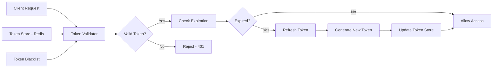

# Token Manager System

The Token Manager provides secure token generation, validation, tracking, and lifecycle management for all API endpoints and services in your n8n environment.

## Features

- JWT token generation with custom claims
- Token validation and verification
- Automatic token rotation
- Token blacklisting and revocation
- Session tracking and management
- Geographic and device-based token policies
- Rate limiting per token
- Token analytics and reporting

## Architecture



## API Reference

### Generate Token

**Endpoint**: `POST /api/v1/tokens/generate`

**Request**:
```json
{
  "userId": "user-123",
  "scope": ["read:workflows", "write:executions"],
  "expiresIn": "24h",
  "metadata": {
    "ip": "192.168.1.100",
    "device": "Chrome/Linux",
    "location": "US"
  }
}
```

**Response**:
```json
{
  "success": true,
  "data": {
    "token": "eyJhbGciOiJIUzI1NiIsInR5cCI6IkpXVCJ9...",
    "refreshToken": "rt_abc123def456",
    "expiresAt": "2025-12-07T11:35:00Z",
    "tokenId": "tok_xyz789"
  }
}
```

### Validate Token

**Endpoint**: `POST /api/v1/tokens/validate`

**Request**:
```json
{
  "token": "eyJhbGciOiJIUzI1NiIsInR5cCI6IkpXVCJ9..."
}
```

**Response**:
```json
{
  "valid": true,
  "data": {
    "userId": "user-123",
    "scope": ["read:workflows", "write:executions"],
    "expiresAt": "2025-12-07T11:35:00Z",
    "issueLocation": "US",
    "lastUsed": "2025-12-06T10:30:00Z"
  }
}
```

### Revoke Token

**Endpoint**: `POST /api/v1/tokens/revoke`

**Request**:
```json
{
  "tokenId": "tok_xyz789",
  "reason": "suspected_breach"
}
```

### Track Token Usage

**Endpoint**: `GET /api/v1/tokens/track/{tokenId}`

**Response**:
```json
{
  "tokenId": "tok_xyz789",
  "userId": "user-123",
  "created": "2025-12-06T09:00:00Z",
  "lastUsed": "2025-12-06T11:30:00Z",
  "usageCount": 145,
  "endpoints": [
    "/api/v1/workflows",
    "/api/v1/executions"
  ],
  "locations": ["US", "UK"],
  "devices": ["Chrome/Linux", "Safari/iOS"]
}
```

## n8n Workflow Integration

### Workflow: Automated Token Rotation

```json
{
  "name": "Token Rotation - Daily",
  "nodes": [
    {
      "name": "Schedule Trigger",
      "type": "n8n-nodes-base.scheduleTrigger",
      "parameters": {
        "rule": {
          "interval": [{ "field": "hours", "hoursInterval": 24 }]
        }
      }
    },
    {
      "name": "Get Active Tokens",
      "type": "n8n-nodes-base.httpRequest",
      "parameters": {
        "url": "http://localhost:5678/api/v1/tokens/active",
        "method": "GET"
      }
    },
    {
      "name": "Filter Expiring Tokens",
      "type": "n8n-nodes-base.code",
      "parameters": {
        "jsCode": "const now = new Date();\nconst threshold = new Date(now.getTime() + 48 * 60 * 60 * 1000);\n\nreturn items.filter(item => {\n  const expiresAt = new Date(item.json.expiresAt);\n  return expiresAt <= threshold;\n});"
      }
    },
    {
      "name": "Rotate Token",
      "type": "n8n-nodes-base.httpRequest",
      "parameters": {
        "url": "http://localhost:5678/api/v1/tokens/rotate",
        "method": "POST",
        "body": {
          "tokenId": "={{$json.tokenId}}"
        }
      }
    },
    {
      "name": "Notify User",
      "type": "n8n-nodes-base.emailSend",
      "parameters": {
        "toEmail": "={{$json.userEmail}}",
        "subject": "Security Alert: Your API Token Has Been Rotated",
        "text": "Your token has been automatically rotated for security. New token expires: {{$json.newExpiresAt}}"
      }
    }
  ],
  "connections": {
    "Schedule Trigger": { "main": [[{ "node": "Get Active Tokens" }]] },
    "Get Active Tokens": { "main": [[{ "node": "Filter Expiring Tokens" }]] },
    "Filter Expiring Tokens": { "main": [[{ "node": "Rotate Token" }]] },
    "Rotate Token": { "main": [[{ "node": "Notify User" }]] }
  }
}
```

## Implementation Example

### Node.js Implementation

```javascript
const jwt = require('jsonwebtoken');
const Redis = require('ioredis');
const crypto = require('crypto');

class TokenManager {
  constructor(config) {
    this.secret = config.secret;
    this.redis = new Redis(config.redisUrl);
    this.defaultExpiry = config.defaultExpiry || '24h';
  }

  /**
   * Generate a new JWT token
   */
  async generateToken(userId, scope, metadata = {}) {
    const tokenId = `tok_${crypto.randomBytes(16).toString('hex')}`;

    const payload = {
      sub: userId,
      jti: tokenId,
      scope: scope,
      iat: Math.floor(Date.now() / 1000),
      metadata: metadata
    };

    const token = jwt.sign(payload, this.secret, {
      expiresIn: this.defaultExpiry,
      algorithm: 'HS256'
    });

    const refreshToken = `rt_${crypto.randomBytes(32).toString('hex')}`;

    // Store token metadata in Redis
    await this.redis.setex(
      `token:${tokenId}`,
      24 * 60 * 60, // 24 hours
      JSON.stringify({
        userId,
        scope,
        metadata,
        refreshToken,
        created: new Date().toISOString()
      })
    );

    return {
      token,
      refreshToken,
      tokenId,
      expiresAt: new Date(Date.now() + 24 * 60 * 60 * 1000).toISOString()
    };
  }

  /**
   * Validate token
   */
  async validateToken(token) {
    try {
      const decoded = jwt.verify(token, this.secret);

      // Check if token is blacklisted
      const isBlacklisted = await this.redis.exists(`blacklist:${decoded.jti}`);
      if (isBlacklisted) {
        return { valid: false, reason: 'Token revoked' };
      }

      // Track token usage
      await this.trackTokenUsage(decoded.jti);

      return {
        valid: true,
        data: decoded
      };
    } catch (error) {
      return {
        valid: false,
        reason: error.message
      };
    }
  }

  /**
   * Revoke token
   */
  async revokeToken(tokenId, reason) {
    // Add to blacklist
    await this.redis.setex(
      `blacklist:${tokenId}`,
      7 * 24 * 60 * 60, // 7 days
      JSON.stringify({
        revokedAt: new Date().toISOString(),
        reason
      })
    );

    // Remove from active tokens
    await this.redis.del(`token:${tokenId}`);

    return { success: true };
  }

  /**
   * Track token usage
   */
  async trackTokenUsage(tokenId) {
    const key = `usage:${tokenId}`;
    await this.redis.incr(key);
    await this.redis.expire(key, 30 * 24 * 60 * 60); // 30 days
    await this.redis.set(`lastused:${tokenId}`, new Date().toISOString());
  }

  /**
   * Get token statistics
   */
  async getTokenStats(tokenId) {
    const tokenData = await this.redis.get(`token:${tokenId}`);
    const usageCount = await this.redis.get(`usage:${tokenId}`) || 0;
    const lastUsed = await this.redis.get(`lastused:${tokenId}`);

    if (!tokenData) {
      return null;
    }

    return {
      ...JSON.parse(tokenData),
      usageCount: parseInt(usageCount),
      lastUsed
    };
  }

  /**
   * Rotate token
   */
  async rotateToken(oldTokenId) {
    const tokenData = await this.redis.get(`token:${oldTokenId}`);
    if (!tokenData) {
      throw new Error('Token not found');
    }

    const { userId, scope, metadata } = JSON.parse(tokenData);

    // Revoke old token
    await this.revokeToken(oldTokenId, 'rotated');

    // Generate new token
    return await this.generateToken(userId, scope, metadata);
  }
}

module.exports = TokenManager;
```

## Security Considerations

1. **Token Secret**: Use a strong, randomly generated secret (at least 256 bits)
2. **Storage**: Never store tokens in localStorage; use httpOnly cookies
3. **Transmission**: Always use HTTPS for token transmission
4. **Expiration**: Set appropriate expiration times based on sensitivity
5. **Scope**: Implement principle of least privilege for token scopes
6. **Rotation**: Rotate tokens regularly, especially for high-privilege accounts
7. **Monitoring**: Track unusual token usage patterns

## Advanced Features

### Geographic Restrictions

```javascript
async validateTokenLocation(token, currentLocation) {
  const decoded = jwt.verify(token, this.secret);
  const allowedLocations = decoded.metadata.allowedLocations || [];

  if (allowedLocations.length > 0 && !allowedLocations.includes(currentLocation)) {
    await this.revokeToken(decoded.jti, 'location_mismatch');
    throw new Error('Token used from unauthorized location');
  }
}
```

### Device Fingerprinting

```javascript
async validateTokenDevice(token, deviceFingerprint) {
  const decoded = jwt.verify(token, this.secret);
  const originalDevice = decoded.metadata.deviceFingerprint;

  if (originalDevice && originalDevice !== deviceFingerprint) {
    // Potential token theft - require re-authentication
    await this.revokeToken(decoded.jti, 'device_mismatch');
    throw new Error('Token used from different device');
  }
}
```

## Metrics & Monitoring

Track these key metrics:
- Token generation rate
- Token validation failures
- Token revocations
- Average token lifetime
- Tokens per user
- Geographic distribution of token usage

## Next Steps

- [Configure AI Defense](./ai-defense.md)
- [Set Up Honeypot System](./honeypot.md)
- [Network Scanner Configuration](./network-scanner.md)
