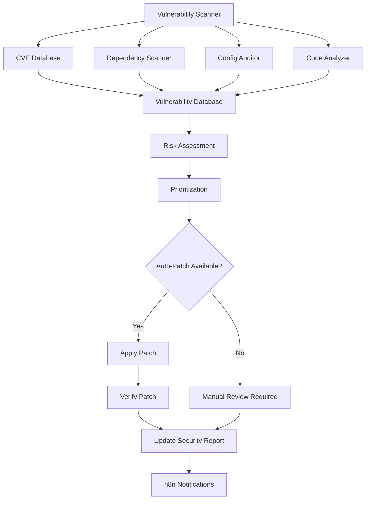

# Vulnerability Scanner & Auto-Patch System

Automated vulnerability scanning and patching system that identifies security weaknesses, closes vulnerabilities (إغلاق الثغرات), and applies security patches automatically.

## Overview

The Vulnerability Scanner provides:
- **CVE Database Integration**: Real-time vulnerability intelligence
- **Dependency Scanning**: Check npm, pip, maven dependencies
- **Configuration Auditing**: Security configuration checks
- **Code Analysis**: Static analysis for security issues
- **Auto-Patching**: Automatic security updates
- **Compliance Checking**: OWASP Top 10, CIS benchmarks
- **Penetration Testing**: Automated security testing

## Architecture



## CVE Scanner

### Features
- Scan for known vulnerabilities
- Check against NVD (National Vulnerability Database)
- CVSS score assessment
- Exploit availability check

### Implementation

```javascript
const axios = require('axios');
const semver = require('semver');

class CVEScanner {
  constructor(apiKey) {
    this.nvdApiUrl = 'https://services.nvd.nist.gov/rest/json/cves/2.0';
    this.apiKey = apiKey;
    this.vulnCache = new Map();
  }

  /**
   * Scan package for known CVEs
   */
  async scanPackage(packageName, version) {
    try {
      const cacheKey = `${packageName}@${version}`;

      // Check cache first
      if (this.vulnCache.has(cacheKey)) {
        return this.vulnCache.get(cacheKey);
      }

      // Query NVD
      const response = await axios.get(this.nvdApiUrl, {
        params: {
          keywordSearch: packageName,
          resultsPerPage: 100
        },
        headers: {
          'apiKey': this.apiKey
        }
      });

      const vulnerabilities = [];

      if (response.data.vulnerabilities) {
        for (const vuln of response.data.vulnerabilities) {
          const cve = vuln.cve;

          // Check if vulnerability affects this version
          if (this.affectsVersion(cve, version)) {
            vulnerabilities.push({
              cveId: cve.id,
              description: cve.descriptions[0]?.value || 'No description',
              severity: this.getSeverity(cve),
              cvssScore: this.getCVSSScore(cve),
              publishedDate: cve.published,
              lastModified: cve.lastModified,
              references: cve.references?.map(r => r.url) || [],
              exploitAvailable: await this.checkExploitAvailability(cve.id)
            });
          }
        }
      }

      const result = {
        package: packageName,
        version: version,
        vulnerabilities: vulnerabilities,
        riskLevel: this.calculateRiskLevel(vulnerabilities),
        scannedAt: new Date()
      };

      // Cache result
      this.vulnCache.set(cacheKey, result);

      return result;
    } catch (error) {
      console.error(`CVE scan error for ${packageName}:`, error.message);
      return {
        package: packageName,
        version: version,
        error: error.message,
        vulnerabilities: []
      };
    }
  }

  /**
   * Check if CVE affects specific version
   */
  affectsVersion(cve, version) {
    // Check CPE configurations
    if (!cve.configurations) return false;

    for (const config of cve.configurations) {
      for (const node of config.nodes || []) {
        for (const cpe of node.cpeMatch || []) {
          if (cpe.vulnerable) {
            // Parse version ranges
            const versionStart = cpe.versionStartIncluding;
            const versionEnd = cpe.versionEndExcluding;

            if (versionStart && versionEnd) {
              if (semver.gte(version, versionStart) && semver.lt(version, versionEnd)) {
                return true;
              }
            }
          }
        }
      }
    }

    return false;
  }

  /**
   * Get CVSS score
   */
  getCVSSScore(cve) {
    if (cve.metrics?.cvssMetricV31) {
      return cve.metrics.cvssMetricV31[0]?.cvssData?.baseScore || 0;
    }
    if (cve.metrics?.cvssMetricV2) {
      return cve.metrics.cvssMetricV2[0]?.cvssData?.baseScore || 0;
    }
    return 0;
  }

  /**
   * Get severity level
   */
  getSeverity(cve) {
    const score = this.getCVSSScore(cve);

    if (score >= 9.0) return 'CRITICAL';
    if (score >= 7.0) return 'HIGH';
    if (score >= 4.0) return 'MEDIUM';
    if (score > 0) return 'LOW';
    return 'NONE';
  }

  /**
   * Check if public exploit exists
   */
  async checkExploitAvailability(cveId) {
    try {
      // Check Exploit-DB
      const response = await axios.get(`https://www.exploit-db.com/search?cve=${cveId}`);
      return response.data.includes('exploits');
    } catch (error) {
      return false;
    }
  }

  /**
   * Calculate overall risk level
   */
  calculateRiskLevel(vulnerabilities) {
    if (vulnerabilities.length === 0) return 'SAFE';

    const critical = vulnerabilities.filter(v => v.severity === 'CRITICAL').length;
    const high = vulnerabilities.filter(v => v.severity === 'HIGH').length;
    const withExploits = vulnerabilities.filter(v => v.exploitAvailable).length;

    if (critical > 0 || withExploits > 0) return 'CRITICAL';
    if (high > 2) return 'HIGH';
    if (high > 0) return 'MEDIUM';
    return 'LOW';
  }
}

module.exports = CVEScanner;
```

## Dependency Scanner

### Scan npm Dependencies

```javascript
const { exec } = require('child_process');
const fs = require('fs').promises;

class DependencyScanner {
  constructor() {
    this.cveScanner = new CVEScanner(process.env.NVD_API_KEY);
  }

  /**
   * Scan npm dependencies
   */
  async scanNpmDependencies(projectPath) {
    try {
      // Read package.json
      const packageJson = JSON.parse(
        await fs.readFile(`${projectPath}/package.json`, 'utf8')
      );

      const dependencies = {
        ...packageJson.dependencies,
        ...packageJson.devDependencies
      };

      const results = [];

      // Scan each dependency
      for (const [name, version] of Object.entries(dependencies)) {
        const cleanVersion = version.replace(/[^0-9.]/g, '');
        const scanResult = await this.cveScanner.scanPackage(name, cleanVersion);
        results.push(scanResult);
      }

      // Run npm audit
      const auditResults = await this.runNpmAudit(projectPath);

      return {
        dependencies: results,
        audit: auditResults,
        summary: this.generateSummary(results, auditResults)
      };
    } catch (error) {
      console.error('Dependency scan error:', error);
      return { error: error.message };
    }
  }

  /**
   * Run npm audit
   */
  async runNpmAudit(projectPath) {
    return new Promise((resolve) => {
      exec(`cd ${projectPath} && npm audit --json`, (error, stdout) => {
        try {
          const auditData = JSON.parse(stdout);
          resolve({
            vulnerabilities: auditData.metadata?.vulnerabilities || {},
            advisories: auditData.advisories || {}
          });
        } catch (e) {
          resolve({ error: 'Failed to parse audit results' });
        }
      });
    });
  }

  /**
   * Generate summary
   */
  generateSummary(cveResults, auditResults) {
    const totalPackages = cveResults.length;
    const vulnerablePackages = cveResults.filter(r => r.vulnerabilities.length > 0).length;

    return {
      totalPackages: totalPackages,
      vulnerablePackages: vulnerablePackages,
      critical: cveResults.filter(r => r.riskLevel === 'CRITICAL').length,
      high: cveResults.filter(r => r.riskLevel === 'HIGH').length,
      medium: cveResults.filter(r => r.riskLevel === 'MEDIUM').length,
      low: cveResults.filter(r => r.riskLevel === 'LOW').length,
      npmAudit: auditResults.vulnerabilities || {}
    };
  }

  /**
   * Scan Python dependencies
   */
  async scanPythonDependencies(projectPath) {
    return new Promise((resolve) => {
      exec(`cd ${projectPath} && pip list --format=json`, async (error, stdout) => {
        if (error) {
          return resolve({ error: error.message });
        }

        const packages = JSON.parse(stdout);
        const results = [];

        for (const pkg of packages) {
          const scanResult = await this.cveScanner.scanPackage(pkg.name, pkg.version);
          results.push(scanResult);
        }

        resolve({
          dependencies: results,
          summary: this.generateSummary(results, {})
        });
      });
    });
  }
}

module.exports = DependencyScanner;
```

## Auto-Patch System

### Implementation

```javascript
const { exec } = require('child_process');
const fs = require('fs').promises;

class AutoPatcher {
  constructor(options = {}) {
    this.autoApply = options.autoApply !== false;
    this.backupEnabled = options.backupEnabled !== false;
    this.testBeforeApply = options.testBeforeApply !== false;
  }

  /**
   * Auto-patch npm vulnerabilities
   */
  async patchNpmVulnerabilities(projectPath, vulnerabilities) {
    const patches = [];

    for (const vuln of vulnerabilities) {
      if (this.shouldAutoPatch(vuln)) {
        const patch = await this.createPatch(vuln, projectPath);
        patches.push(patch);
      }
    }

    if (this.autoApply) {
      return await this.applyPatches(patches, projectPath);
    }

    return {
      patches: patches,
      applied: false,
      message: 'Patches created but not applied (auto-apply disabled)'
    };
  }

  /**
   * Determine if vulnerability should be auto-patched
   */
  shouldAutoPatch(vulnerability) {
    // Auto-patch critical and high severity issues
    if (vulnerability.severity === 'CRITICAL' || vulnerability.severity === 'HIGH') {
      // Only if patch is available and low risk
      return vulnerability.patchAvailable && !vulnerability.breakingChange;
    }

    return false;
  }

  /**
   * Create patch for vulnerability
   */
  async createPatch(vulnerability, projectPath) {
    // Determine patch action
    let action = 'update';
    let targetVersion = vulnerability.fixedVersion;

    if (!targetVersion) {
      action = 'remove';
    }

    return {
      package: vulnerability.package,
      currentVersion: vulnerability.version,
      targetVersion: targetVersion,
      action: action,
      cveId: vulnerability.cveId,
      severity: vulnerability.severity,
      created: new Date()
    };
  }

  /**
   * Apply patches
   */
  async applyPatches(patches, projectPath) {
    const results = [];

    // Create backup first
    if (this.backupEnabled) {
      await this.createBackup(projectPath);
    }

    for (const patch of patches) {
      try {
        const result = await this.applyPatch(patch, projectPath);
        results.push(result);
      } catch (error) {
        results.push({
          patch: patch,
          success: false,
          error: error.message
        });
      }
    }

    // Test after patching
    if (this.testBeforeApply) {
      const testResult = await this.runTests(projectPath);
      if (!testResult.success) {
        // Rollback if tests fail
        await this.rollback(projectPath);
        return {
          success: false,
          message: 'Tests failed after patching, rolled back',
          testResult: testResult
        };
      }
    }

    return {
      success: true,
      patches: results,
      summary: {
        total: patches.length,
        successful: results.filter(r => r.success).length,
        failed: results.filter(r => !r.success).length
      }
    };
  }

  /**
   * Apply individual patch
   */
  async applyPatch(patch, projectPath) {
    return new Promise((resolve) => {
      const command = patch.action === 'update'
        ? `npm install ${patch.package}@${patch.targetVersion}`
        : `npm uninstall ${patch.package}`;

      exec(`cd ${projectPath} && ${command}`, (error, stdout, stderr) => {
        resolve({
          patch: patch,
          success: !error,
          output: stdout,
          error: error ? error.message : null
        });
      });
    });
  }

  /**
   * Create backup
   */
  async createBackup(projectPath) {
    const timestamp = new Date().toISOString().replace(/:/g, '-');
    const backupPath = `${projectPath}/.backup-${timestamp}`;

    await fs.mkdir(backupPath, { recursive: true });
    await fs.copyFile(
      `${projectPath}/package.json`,
      `${backupPath}/package.json`
    );
    await fs.copyFile(
      `${projectPath}/package-lock.json`,
      `${backupPath}/package-lock.json`
    );

    return backupPath;
  }

  /**
   * Run tests
   */
  async runTests(projectPath) {
    return new Promise((resolve) => {
      exec(`cd ${projectPath} && npm test`, (error, stdout, stderr) => {
        resolve({
          success: !error,
          output: stdout,
          error: stderr
        });
      });
    });
  }

  /**
   * Rollback changes
   */
  async rollback(projectPath) {
    // Find most recent backup
    const files = await fs.readdir(projectPath);
    const backups = files.filter(f => f.startsWith('.backup-'));
    const latestBackup = backups.sort().reverse()[0];

    if (latestBackup) {
      await fs.copyFile(
        `${projectPath}/${latestBackup}/package.json`,
        `${projectPath}/package.json`
      );
      await fs.copyFile(
        `${projectPath}/${latestBackup}/package-lock.json`,
        `${projectPath}/package-lock.json`
      );

      // Reinstall dependencies
      return new Promise((resolve) => {
        exec(`cd ${projectPath} && npm install`, () => {
          resolve({ success: true });
        });
      });
    }

    return { success: false, message: 'No backup found' };
  }
}

module.exports = AutoPatcher;
```

## Configuration Auditor

### Security Configuration Checks

```javascript
class ConfigurationAuditor {
  constructor() {
    this.checks = [
      this.checkSSLConfig,
      this.checkDatabaseSecurity,
      this.checkCORS,
      this.checkSecurityHeaders,
      this.checkAuthentication,
      this.checkEncryption,
      this.checkLogging
    ];
  }

  /**
   * Audit all configurations
   */
  async auditConfiguration(config) {
    const results = [];

    for (const check of this.checks) {
      const result = await check.call(this, config);
      results.push(result);
    }

    return {
      checks: results,
      score: this.calculateSecurityScore(results),
      recommendations: this.generateRecommendations(results)
    };
  }

  /**
   * Check SSL/TLS configuration
   */
  async checkSSLConfig(config) {
    const issues = [];

    if (!config.ssl || !config.ssl.enabled) {
      issues.push({
        severity: 'CRITICAL',
        message: 'SSL/TLS not enabled'
      });
    }

    if (config.ssl?.protocol && config.ssl.protocol.includes('TLSv1.0')) {
      issues.push({
        severity: 'HIGH',
        message: 'Outdated TLS version (TLSv1.0) enabled'
      });
    }

    return {
      name: 'SSL/TLS Configuration',
      passed: issues.length === 0,
      issues: issues
    };
  }

  /**
   * Check database security
   */
  async checkDatabaseSecurity(config) {
    const issues = [];

    if (config.database?.password === 'password' || !config.database?.password) {
      issues.push({
        severity: 'CRITICAL',
        message: 'Weak or default database password'
      });
    }

    if (!config.database?.ssl) {
      issues.push({
        severity: 'HIGH',
        message: 'Database SSL not enabled'
      });
    }

    return {
      name: 'Database Security',
      passed: issues.length === 0,
      issues: issues
    };
  }

  /**
   * Check CORS configuration
   */
  async checkCORS(config) {
    const issues = [];

    if (config.cors?.origin === '*') {
      issues.push({
        severity: 'HIGH',
        message: 'CORS allows all origins (use specific domains)'
      });
    }

    return {
      name: 'CORS Configuration',
      passed: issues.length === 0,
      issues: issues
    };
  }

  /**
   * Calculate security score
   */
  calculateSecurityScore(results) {
    let score = 100;

    for (const result of results) {
      for (const issue of result.issues) {
        if (issue.severity === 'CRITICAL') score -= 20;
        else if (issue.severity === 'HIGH') score -= 10;
        else if (issue.severity === 'MEDIUM') score -= 5;
        else if (issue.severity === 'LOW') score -= 2;
      }
    }

    return Math.max(0, score);
  }

  /**
   * Generate recommendations
   */
  generateRecommendations(results) {
    const recommendations = [];

    for (const result of results) {
      if (!result.passed) {
        recommendations.push({
          category: result.name,
          priority: this.getPriority(result.issues),
          actions: result.issues.map(i => i.message)
        });
      }
    }

    return recommendations.sort((a, b) => b.priority - a.priority);
  }

  /**
   * Get priority level
   */
  getPriority(issues) {
    const severities = issues.map(i => i.severity);
    if (severities.includes('CRITICAL')) return 5;
    if (severities.includes('HIGH')) return 4;
    if (severities.includes('MEDIUM')) return 3;
    if (severities.includes('LOW')) return 2;
    return 1;
  }
}

module.exports = ConfigurationAuditor;
```

## n8n Workflow Integration

### Workflow: Automated Vulnerability Scanning

```json
{
  "name": "Vulnerability Scanner - Daily",
  "nodes": [
    {
      "name": "Schedule - Daily 2 AM",
      "type": "n8n-nodes-base.scheduleTrigger",
      "parameters": {
        "rule": {
          "interval": [{ "field": "hours", "hoursInterval": 24 }]
        },
        "triggerAtHour": 2
      }
    },
    {
      "name": "Scan Dependencies",
      "type": "n8n-nodes-base.httpRequest",
      "parameters": {
        "url": "http://localhost:5678/api/v1/security/scan/dependencies",
        "method": "POST",
        "body": {
          "projectPath": "/app"
        }
      }
    },
    {
      "name": "Audit Configuration",
      "type": "n8n-nodes-base.httpRequest",
      "parameters": {
        "url": "http://localhost:5678/api/v1/security/audit/config",
        "method": "POST"
      }
    },
    {
      "name": "Analyze Results",
      "type": "n8n-nodes-base.code",
      "parameters": {
        "jsCode": "const critical = $json.summary.critical || 0;\nconst high = $json.summary.high || 0;\n\nreturn [{\n  json: {\n    ...$json,\n    requiresAction: critical > 0 || high > 5,\n    autoFixAvailable: $json.patches?.filter(p => p.patchAvailable).length > 0\n  }\n}];"
      }
    },
    {
      "name": "Should Auto-Patch?",
      "type": "n8n-nodes-base.if",
      "parameters": {
        "conditions": {
          "boolean": [
            {
              "value1": "={{$json.autoFixAvailable}}",
              "value2": true
            }
          ]
        }
      }
    },
    {
      "name": "Apply Patches",
      "type": "n8n-nodes-base.httpRequest",
      "parameters": {
        "url": "http://localhost:5678/api/v1/security/patch/apply",
        "method": "POST",
        "body": {
          "vulnerabilities": "={{$json.vulnerabilities}}",
          "autoApply": true,
          "testFirst": true
        }
      }
    },
    {
      "name": "Send Report",
      "type": "n8n-nodes-base.emailSend",
      "parameters": {
        "toEmail": "security@example.com",
        "subject": "Security Scan Report - {{$now.format('YYYY-MM-DD')}}",
        "html": "<h2>Vulnerability Scan Report</h2><p>Critical: {{$json.summary.critical}}</p><p>High: {{$json.summary.high}}</p><p>Patches Applied: {{$json.patchesApplied}}</p>"
      }
    },
    {
      "name": "Alert on Critical",
      "type": "n8n-nodes-base.slack",
      "parameters": {
        "channel": "#security-critical",
        "text": "🚨 CRITICAL VULNERABILITIES DETECTED\\n\\nCount: {{$json.summary.critical}}\\n\\nImmediate action required!"
      }
    }
  ],
  "connections": {
    "Schedule - Daily 2 AM": {
      "main": [[{ "node": "Scan Dependencies" }, { "node": "Audit Configuration" }]]
    },
    "Scan Dependencies": {
      "main": [[{ "node": "Analyze Results" }]]
    },
    "Analyze Results": {
      "main": [[{ "node": "Should Auto-Patch?" }]]
    },
    "Should Auto-Patch?": {
      "main": [
        [{ "node": "Apply Patches" }],
        [{ "node": "Send Report" }]
      ]
    },
    "Apply Patches": {
      "main": [[{ "node": "Send Report" }]]
    },
    "Send Report": {
      "main": [[{ "node": "Alert on Critical" }]]
    }
  }
}
```

## API Reference

### Scan Dependencies
**Endpoint**: `POST /api/v1/security/scan/dependencies`

### Audit Configuration
**Endpoint**: `POST /api/v1/security/audit/config`

### Apply Patches
**Endpoint**: `POST /api/v1/security/patch/apply`

### Get Vulnerability Report
**Endpoint**: `GET /api/v1/security/report`

## Best Practices

1. **Regular Scanning**: Run scans daily or after each deployment
2. **Prioritize Fixes**: Focus on CRITICAL and HIGH severity first
3. **Test Patches**: Always test in staging before production
4. **Monitor CVE Feeds**: Stay updated with latest vulnerabilities
5. **Document Exceptions**: Track why certain vulns can't be fixed
6. **Compliance**: Map findings to compliance requirements (PCI-DSS, HIPAA, etc.)

## Next Steps

- [Ethical Hacking & Penetration Testing](./ethical-hacking.md)
- [Traffic Scanner](./traffic-scanner.md)
- [Automated Response Workflows](./automation-workflows.md)
